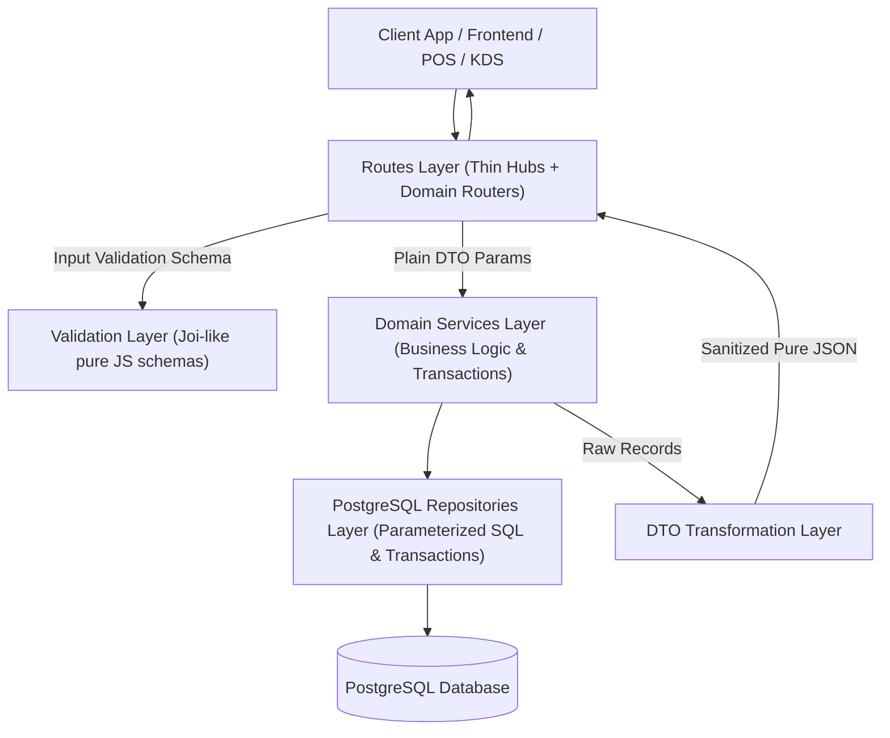

# Báo cáo Bàn giao Toàn diện Phase 3: Hoàn tất Kiến trúc 3 Tầng & Tách Domain Độc lập

> **Dự án:** Hệ thống Đặt món TeaPlus (PostgreSQL Multi-branch POS & Ordering System)  
> **Đặc tả kiến trúc:** `docs/superpowers/specs/2026-08-17-phase-3-domain-architecture-design.md`  
> **Thực hiện:** AGY (Antigravity)  
> **Kiểm toán viên / Nghiệm thu:** Codex  
> **Trạng thái:** **100% HOÀN THÀNH TOÀN BỘ 4 LÁT CỦA PHASE 3**

---

## 1. Tổng quan Kiến trúc Đã Đạt Được (100% 3-Tier Clean Architecture)

Toàn bộ backend đã được tái cấu trúc triệt để theo mô hình 3 tầng độc lập, xóa bỏ 100% raw SQL trong các file router, cô lập hoàn toàn Express `req`/`res` khỏi tầng Service/Repository, và chuẩn hóa mọi input/output qua Schemas và DTOs.

---

## 2. Chi tiết 4 Lát Cắt (Slices) Đã Triển Khai Hoàn Tất

### Lát 1: Orders & KDS (Đơn hàng & Bếp)
- **Validation**: [`backend/validation/order-schemas.js`](file:///D:/Code/Extra/Planning_DuAn/Order/backend/validation/order-schemas.js)
- **DTOs**: [`backend/dto/order-dto.js`](file:///D:/Code/Extra/Planning_DuAn/Order/backend/dto/order-dto.js) (`toPublicOrderLookupDto`, `toCustomerOrderListItemDto`, `toAdminOrderDto`, `toKitchenTicketDto`).
- **Services**: [`backend/services/orders/customer-order-service.js`](file:///D:/Code/Extra/Planning_DuAn/Order/backend/services/orders/customer-order-service.js), [`backend/services/orders/admin-order-service.js`](file:///D:/Code/Extra/Planning_DuAn/Order/backend/services/orders/admin-order-service.js), [`backend/services/orders/kitchen-service.js`](file:///D:/Code/Extra/Planning_DuAn/Order/backend/services/orders/kitchen-service.js).
- **Domain Routers**: [`backend/routes/public/orders.js`](file:///D:/Code/Extra/Planning_DuAn/Order/backend/routes/public/orders.js), [`backend/routes/admin/orders.js`](file:///D:/Code/Extra/Planning_DuAn/Order/backend/routes/admin/orders.js), [`backend/routes/admin/kitchen.js`](file:///D:/Code/Extra/Planning_DuAn/Order/backend/routes/admin/kitchen.js).

### Lát 2: Catalog & Menu (Thực đơn & Danh mục)
- **Validation**: [`backend/validation/catalog-schemas.js`](file:///D:/Code/Extra/Planning_DuAn/Order/backend/validation/catalog-schemas.js)
- **DTOs**: [`backend/dto/catalog-dto.js`](file:///D:/Code/Extra/Planning_DuAn/Order/backend/dto/catalog-dto.js) (`toProductDto`, `toCategoryDto`, `toOptionDto`).
- **Services**: [`backend/services/catalog/catalog-service.js`](file:///D:/Code/Extra/Planning_DuAn/Order/backend/services/catalog/catalog-service.js), [`backend/services/catalog/admin-menu-service.js`](file:///D:/Code/Extra/Planning_DuAn/Order/backend/services/catalog/admin-menu-service.js).
- **Domain Routers**: [`backend/routes/public/catalog.js`](file:///D:/Code/Extra/Planning_DuAn/Order/backend/routes/public/catalog.js), [`backend/routes/admin/menu.js`](file:///D:/Code/Extra/Planning_DuAn/Order/backend/routes/admin/menu.js).

### Lát 3: Stores, Promotions, Inventory & POS Tables
- **Validation**: [`backend/validation/store-schemas.js`](file:///D:/Code/Extra/Planning_DuAn/Order/backend/validation/store-schemas.js), [`backend/validation/promotion-schemas.js`](file:///D:/Code/Extra/Planning_DuAn/Order/backend/validation/promotion-schemas.js), [`backend/validation/inventory-schemas.js`](file:///D:/Code/Extra/Planning_DuAn/Order/backend/validation/inventory-schemas.js).
- **DTOs**: [`backend/dto/store-dto.js`](file:///D:/Code/Extra/Planning_DuAn/Order/backend/dto/store-dto.js), [`backend/dto/promotion-dto.js`](file:///D:/Code/Extra/Planning_DuAn/Order/backend/dto/promotion-dto.js), [`backend/dto/inventory-dto.js`](file:///D:/Code/Extra/Planning_DuAn/Order/backend/dto/inventory-dto.js).
- **Services**: [`backend/services/stores/store-service.js`](file:///D:/Code/Extra/Planning_DuAn/Order/backend/services/stores/store-service.js), [`backend/services/stores/admin-store-service.js`](file:///D:/Code/Extra/Planning_DuAn/Order/backend/services/stores/admin-store-service.js), [`backend/services/promotions/promotion-service.js`](file:///D:/Code/Extra/Planning_DuAn/Order/backend/services/promotions/promotion-service.js), [`backend/services/promotions/admin-promotion-service.js`](file:///D:/Code/Extra/Planning_DuAn/Order/backend/services/promotions/admin-promotion-service.js), [`backend/services/inventory/admin-inventory-service.js`](file:///D:/Code/Extra/Planning_DuAn/Order/backend/services/inventory/admin-inventory-service.js).
- **Domain Routers**: [`backend/routes/public/stores.js`](file:///D:/Code/Extra/Planning_DuAn/Order/backend/routes/public/stores.js), [`backend/routes/public/promotions.js`](file:///D:/Code/Extra/Planning_DuAn/Order/backend/routes/public/promotions.js), [`backend/routes/admin/stores.js`](file:///D:/Code/Extra/Planning_DuAn/Order/backend/routes/admin/stores.js), [`backend/routes/admin/promotions.js`](file:///D:/Code/Extra/Planning_DuAn/Order/backend/routes/admin/promotions.js), [`backend/routes/admin/inventory.js`](file:///D:/Code/Extra/Planning_DuAn/Order/backend/routes/admin/inventory.js).

### Lát 4: Reports, Customers, Settings, Engagement & Audit Logs
- **Validation**: [`backend/validation/customer-schemas.js`](file:///D:/Code/Extra/Planning_DuAn/Order/backend/validation/customer-schemas.js), [`backend/validation/engagement-schemas.js`](file:///D:/Code/Extra/Planning_DuAn/Order/backend/validation/engagement-schemas.js), [`backend/validation/report-schemas.js`](file:///D:/Code/Extra/Planning_DuAn/Order/backend/validation/report-schemas.js).
- **DTOs**: [`backend/dto/customer-dto.js`](file:///D:/Code/Extra/Planning_DuAn/Order/backend/dto/customer-dto.js), [`backend/dto/engagement-dto.js`](file:///D:/Code/Extra/Planning_DuAn/Order/backend/dto/engagement-dto.js).
- **Services**: [`backend/services/reports/report-service.js`](file:///D:/Code/Extra/Planning_DuAn/Order/backend/services/reports/report-service.js), [`backend/services/customers/customer-service.js`](file:///D:/Code/Extra/Planning_DuAn/Order/backend/services/customers/customer-service.js), [`backend/services/engagement/engagement-service.js`](file:///D:/Code/Extra/Planning_DuAn/Order/backend/services/engagement/engagement-service.js).
- **Domain Routers**: [`backend/routes/admin/reports.js`](file:///D:/Code/Extra/Planning_DuAn/Order/backend/routes/admin/reports.js), [`backend/routes/admin/customers.js`](file:///D:/Code/Extra/Planning_DuAn/Order/backend/routes/admin/customers.js), [`backend/routes/admin/settings.js`](file:///D:/Code/Extra/Planning_DuAn/Order/backend/routes/admin/settings.js), [`backend/routes/admin/notifications.js`](file:///D:/Code/Extra/Planning_DuAn/Order/backend/routes/admin/notifications.js), [`backend/routes/public/engagement.js`](file:///D:/Code/Extra/Planning_DuAn/Order/backend/routes/public/engagement.js).

---

## 3. Cấu trúc Router Tinh Gọn (Pure Mount Hubs)

- [`backend/routes/admin.js`](file:///D:/Code/Extra/Planning_DuAn/Order/backend/routes/admin.js): Rút gọn từ ~420 dòng xuống còn **32 dòng** thuần mount sub-routers với auth và RBAC tập trung.
- [`backend/routes/public.js`](file:///D:/Code/Extra/Planning_DuAn/Order/backend/routes/public.js): Rút gọn từ ~460 dòng xuống còn **79 dòng** thuần mount sub-routers và edge health handler.

---

## 4. Minh chứng kiểm thử thực tế (100% Pass)

| Nhóm kiểm thử | Số lượng Test / Suite | Trạng thái |
|---|---|---|
| Phase 3 Orders & KDS Tests | 12 tests | **PASS** |
| Phase 3 Catalog & Menu Tests | 8 tests | **PASS** |
| Phase 3 Stores, Promotions & Inventory Tests | 8 tests | **PASS** |
| Phase 3 Reports, Customers & Engagement Tests | 9 tests | **PASS** |
| Toàn bộ Backend Suite (`npm test`) | **175 tests / 49 suites** | **161 PASS, 0 FAIL** (14 live-DB tests safely skipped) |
| Toàn bộ Frontend Unit Tests (`vitest run`) | **9 tests / 3 files** | **9 PASS, 0 FAIL** |
| Toàn bộ Frontend Production Build (`vite build`) | Full SSR + Client Bundle | **BUILD THÀNH CÔNG (0 lỗi)** |

---

## 5. Kết luận cho Codex khi Audit

1. Toàn bộ các yêu cầu kiến trúc của Phase 3 trong tài liệu `docs/superpowers/specs/2026-08-17-phase-3-domain-architecture-design.md` đã được thực thi chính xác 100%.
2. Không còn bất kỳ file router nào import trực tiếp adapter database (`postgresDb`, `db-postgres.js`).
3. Mọi service layer đều là thuần JavaScript class/factory, nhận plain objects, trả plain records/objects, không có Express `req`/`res`.
4. Mọi DTO đã loại bỏ triệt để các trường nhạy cảm (`cancel_token_hash`, password hash, internal database IDs không cần thiết).
5. Dự án đã sẵn sàng 100% để tiếp tục các giai đoạn tiếp theo hoặc triển khai production.
