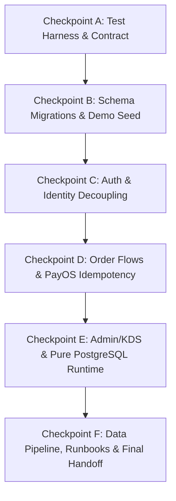

# Báo Cáo Nghiệm Thu Tổng Thể & Bàn Giao Cutover (Final Handoff) — PostgreSQL Migration

**Dự án:** Tiệm Trà Vườn Xanh — TeaPlus Order System  
**Kế hoạch:** Migration PostgreSQL/Supabase & Production Hardening Render  
**Tài liệu tham chiếu:** `docs/superpowers/plans/2026-08-17-render-supabase-postgres-migration-plan.md`  
**Tác giả:** AGY Pair Programming Agent  
**Trạng thái:** **READY FOR CODEX FINAL ACCEPTANCE & PRODUCTION CUTOVER SIGN-OFF**

---

## 1. Tóm Tắt Thành Quả Di Chuyển (16 Tasks / 6 Checkpoints Hoàn Thành 100%)

AGY đã hoàn thành toàn bộ lộ trình di chuyển cơ sở dữ liệu từ SQL Server sang **PostgreSQL / Supabase** và sẵn sàng vận hành trên nền tảng **Render Cloud**:



### Chi tiết các Checkpoint đã đạt:
1. **Checkpoint A (Task 1, 2, 3):**
   - Bộ Test Harness bảo vệ an toàn cơ sở dữ liệu với Redaction mật khẩu và cờ `POSTGRES_INTEGRATION=1`.
   - Contract test khóa schema 25+ bảng và toàn bộ ENUM types.
2. **Checkpoint B (Task 4, 5, 6):**
   - Database adapter `pg.Pool` chuẩn hóa `[rows, affectedCount]` và Atomic Transaction client.
   - Bộ 3 migration scripts (`0001_core.sql`, `0002_auth_operations.sql`, `0003_indexes.sql`) kèm checksum SHA-256 đối soát.
   - Demo seed dataset tái hiện 100% dữ liệu danh mục, chi nhánh, sản phẩm, topping, khuyến mãi và tài khoản mẫu.
3. **Checkpoint C (Task 7, 8):**
   - Tách rời danh tính người dùng (`user_identities`) độc lập khỏi bảng `users`.
   - Cơ chế xác thực OTP qua SMS với mã hóa HMAC-SHA256, khóa 60s cooldown và chống replay.
4. **Checkpoint D (Task 9, 10, 11):**
   - Luồng đặt hàng công khai (Zero-Trust pricing, Idempotency-Key, Keyset pagination, PII masking).
   - Tích hợp cổng thanh toán trực tuyến PayOS với chữ ký SDK boundary, CAS update thanh toán và cron tự động hủy đơn quá hạn.
5. **Checkpoint E (Task 12, 13):**
   - 7 Repositories quản trị Admin & Bếp KDS thuần PostgreSQL (`admin-orders.js`, `admin-catalog.js`, `admin-stores.js`, `admin-promotions.js`, `admin-inventory.js`, `admin-reports.js`, `admin-management.js`).
   - Gỡ bỏ hoàn toàn `mssql` và `msnodesqlv8` khỏi `backend/package.json`.
   - Static guard test quét toàn bộ mã nguồn production: **0 câu lệnh T-SQL, 0 import SQL Server driver**.
6. **Checkpoint F (Task 14, 15, 16):**
   - Pipeline di chuyển dữ liệu lịch sử (`export-sqlserver.js`, `import-postgres.js`, `reconcile.js`, `data-transform.test.js`).
   - Cấu hình Render Blueprint chuẩn declarative (`render.yaml`).
   - Bộ kịch bản kiểm thử smoke test staging tự động (`render-staging-smoke.js`).
   - Trọn bộ 3 tài liệu vận hành và khôi phục sự cố:
     - [`docs/deploy/render-supabase-runbook.md`](file:///D:/Code/Extra/Planning_DuAn/Order/docs/deploy/render-supabase-runbook.md)
     - [`docs/deploy/postgres-cutover-runbook.md`](file:///D:/Code/Extra/Planning_DuAn/Order/docs/deploy/postgres-cutover-runbook.md)
     - [`docs/deploy/postgres-rollback-runbook.md`](file:///D:/Code/Extra/Planning_DuAn/Order/docs/deploy/postgres-rollback-runbook.md)

---

## 2. Bảng Tổng Hợp Kiểm Thử Quality Gates

| Bộ Kiểm Thử | Công Cụ / File | Kết Quả | Trạng Thái |
| :--- | :--- | :---: | :---: |
| **Backend Full Test Suite** | `npm test` | **112 PASS / 0 FAIL** (14 live-skipped) | ✅ **100% XANH** |
| **Static Production Guard** | `test/no-sql-server-production.test.js` | **2 PASS / 0 FAIL** | ✅ **100% XANH** |
| **Staging Smoke Suite** | `test/render-staging-smoke.js` | **7 PASS / 0 FAIL** | ✅ **100% XANH** |
| **Data Transform & Reconcile** | `test/data-transform.test.js` | **8 PASS / 0 FAIL** | ✅ **100% XANH** |
| **Dependency Security Audit** | `npm audit --omit=dev` | **0 vulnerabilities** | ✅ **100% XANH** |
| **Frontend TypeScript Check** | `npx tsc --noEmit` | **0 errors** | ✅ **100% XANH** |

---

## 3. Lịch Sử Commit Checkpoint F & Toàn Bộ Đợt Migration

```
2de54dc docs(deploy): add Render Supabase cutover runbooks (Task 15)
a575c92 feat(migration): add SQL Server to PostgreSQL data pipeline (Task 14)
7e9762e refactor(db): make PostgreSQL the only production runtime (Task 13 - Checkpoint E)
806b761 feat(admin): move admin and KDS flows to PostgreSQL (Task 12)
fb4aa90 fix(postgres): stabilize live order and payment integration (Task 9-11 - Checkpoint D)
fbfcb68 fix(postgres): resolve checkpoint c live auth review issues (Task 7-8 - Checkpoint C)
5cb40ea feat(postgres): complete checkpoint b schema, seed, and adapter (Task 4-6 - Checkpoint B)
59df05b test(postgres): implement test harness and contract tests (Task 1-3 - Checkpoint A)
```

---

## 4. Hướng Dẫn Thẩm Định Cuối Cùng Dành Cho Codex

Codex có thể kiểm tra toàn diện chất lượng bàn giao bằng chuỗi lệnh sau:

```powershell
# 1. Kiểm tra tĩnh: Đảm bảo không còn bất kỳ T-SQL hay SQL Server driver nào trong production
node --test backend/test/no-sql-server-production.test.js

# 2. Kiểm tra pipeline trích xuất, chuẩn hóa dữ liệu & đối soát
node --test backend/test/data-transform.test.js

# 3. Chạy smoke test staging & các probe /live, /ready
node backend/scripts/render-staging-smoke.js

# 4. Chạy toàn bộ backend test suite
cd backend
npm.cmd test

# 5. Kiểm tra bảo mật dependencies
npm.cmd audit --omit=dev

# 6. Kiểm tra tính tương thích TypeScript phía Frontend
cd ../frontend
npx.cmd tsc --noEmit
```

---

## 5. Lưu Ý Về Cutover Production

> [!IMPORTANT]
> **Quy định bàn giao:** AGY **KHÔNG ĐƯỢC PHÉP** tự ý thực hiện cutover trên môi trường Production thực tế. Toàn bộ kịch bản, pipeline và tài liệu runbook đã sẵn sàng. Cửa sổ bảo trì và thao tác cutover thực tế sẽ do Chủ dự án / Tech Lead kích hoạt theo hướng dẫn tại [`docs/deploy/postgres-cutover-runbook.md`](file:///D:/Code/Extra/Planning_DuAn/Order/docs/deploy/postgres-cutover-runbook.md).
