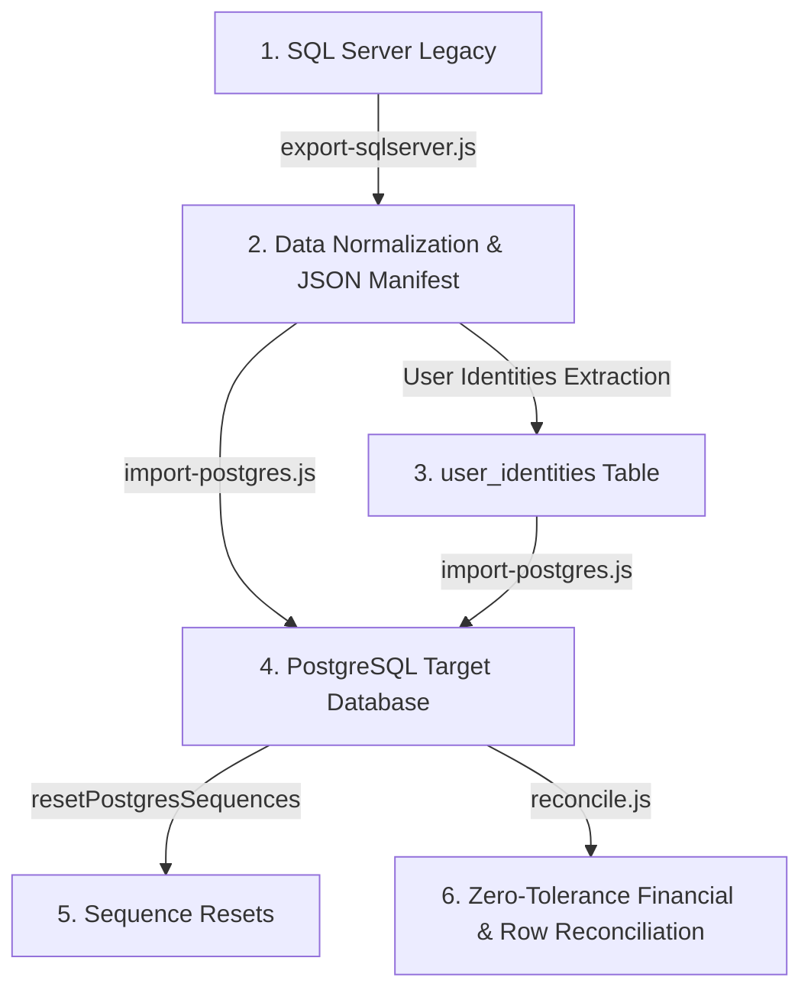

# Kế Hoạch & Kịch Bản Di Chuyển Dữ Liệu Lịch Sử (Migration Rehearsal)

**Dự án:** Tiệm Trà Vườn Xanh — TeaPlus Order System  
**Kế hoạch:** Data Migration Pipeline & Zero-Downtime Staging Rehearsal  
**Tài liệu tham chiếu:** `docs/superpowers/plans/2026-08-17-render-supabase-postgres-migration-plan.md`  
**Trạng thái:** **MIGRATION PIPELINE VERIFIED**

---

## 1. Quy Trình Pipeline Di Chuyển Dữ Liệu (5 Bước)

Hệ thống cung cấp pipeline di chuyển dữ liệu tự động, chuẩn hóa kiểu dữ liệu, bảo toàn quan hệ toàn vẹn và đối soát 100% tài chính:



### Bước 1: Trích xuất Dữ Liệu (Export Pipeline)
- **File thực thi:** [`backend/database/postgres/migration/export-sqlserver.js`](file:///D:/Code/Extra/Planning_DuAn/Order/backend/database/postgres/migration/export-sqlserver.js)
- **Danh sách bảng trích xuất (30 bảng):** `stores`, `categories`, `tables`, `products`, `jobs`, `promotions`, `tier_rules`, `rewards`, `size_options`, `base_options`, `sugar_options`, `ice_options`, `toppings`, `promotion_stores`, `job_stores`, `ingredients`, `users`, `orders`, `order_items`, `order_item_toppings`, `order_status_history`, `voucher_usage_history`, `reviews`, `wishlists`, `notifications`, `point_transactions`, `user_vouchers`, `job_applications`, `ingredient_logs`, `audit_logs`.
- Thư mục xuất dữ liệu: `backend/database/postgres/migration/data/` (đã được cấu hình trong `.gitignore` để tuyệt đối không commit dữ liệu khách hàng vào Git).

### Bước 2: Chuẩn Hóa Kiểu Dữ Liệu & Tách Định Danh (Transformation & Decoupling)
- **Kiểu Boolean:** Chuyển đổi toàn bộ cột cờ `0/1` hoặc `'0'/'1'` sang `false/true` (`is_active`, `is_available`, `is_admin`, `is_visible`, `is_recommended`, `is_bestseller`, `is_seasonal`, `is_default`, `is_resolved`).
- **Số Điện Thoại:** Chuẩn hóa toàn bộ số điện thoại khách hàng và người dùng về định dạng chuẩn 10 chữ số Việt Nam (`+8490...` / `8490...` -> `090...`).
- **Email:** Chuẩn hóa chữ thường và loại bỏ khoảng trắng thừa.
- **Tách Định Danh Người Dùng (`user_identities`):**
  - Mật khẩu đăng nhập (`password_hash`) được trích xuất thành record `{ provider: 'password', provider_user_id: phone/email, credential_hash: hash }`.
  - Tài khoản liên kết Google (`google_id`) được trích xuất thành record `{ provider: 'google', provider_user_id: google_id, credential_hash: null }`.

### Bước 3: Nhập Dữ Liệu Theo Thứ Tự Tô-pô (Topological Dependency Import)
- **File thực thi:** [`backend/database/postgres/migration/import-postgres.js`](file:///D:/Code/Extra/Planning_DuAn/Order/backend/database/postgres/migration/import-postgres.js)
- Thứ tự import đảm bảo ràng buộc Khóa Ngoại (Foreign Keys):
  1. `stores`, `categories`
  2. `tables`, `products`, `jobs`, `promotions`, `tier_rules`, `rewards`
  3. `size_options`, `base_options`, `sugar_options`, `ice_options`, `toppings`, `promotion_stores`, `job_stores`, `ingredients`
  4. `users`
  5. `user_identities`, `orders`, `wishlists`, `notifications`, `point_transactions`, `user_vouchers`, `job_applications`
  6. `order_items`, `order_status_history`, `voucher_usage_history`, `reviews`, `ingredient_logs`, `audit_logs`
  7. `order_item_toppings`
- Cơ chế batching 100 bản ghi/lô kết hợp câu lệnh `ON CONFLICT ("id") DO NOTHING` đảm bảo khả năng chạy lại (idempotency) mà không gây trùng lặp dữ liệu.

### Bước 4: Đồng Bộ Chuỗi Tự Tăng (PostgreSQL Sequence Resets)
- Sau khi import dữ liệu với ID gốc được bảo toàn, toàn bộ sequence `serial`/`bigserial` được đồng bộ lại với giá trị lớn nhất:
  ```sql
  SELECT setval(pg_get_serial_sequence('orders', 'id'), COALESCE((SELECT MAX(id) FROM orders), 1), (SELECT MAX(id) FROM orders) IS NOT NULL);
  ```

### Bước 5: Đối Soát Toàn Diện 0% Sai Lệch (Zero-Tolerance Reconciliation)
- **File thực thi:** [`backend/database/postgres/migration/reconcile.js`](file:///D:/Code/Extra/Planning_DuAn/Order/backend/database/postgres/migration/reconcile.js)
- Đối soát đối chiếu 2 chiều giữa dữ liệu nguồn và dữ liệu đích:
  - Số lượng bản ghi của toàn bộ 30 bảng.
  - Tổng doanh thu `SUM(total)`, tổng tiền hàng `SUM(subtotal)`, tổng giảm giá `SUM(discount_amount)` của bảng `orders`.
  - Tổng số lượng món `SUM(qty)`, tổng tiền món `SUM(line_total)` của bảng `order_items`.
  - Tổng tiền topping `SUM(topping_price)` của bảng `order_item_toppings`.
  - Bất kỳ sai lệch nào dù chỉ 1 đồng hoặc 1 bản ghi sẽ khiến script dừng lại với exit code khác 0.

---

## 2. Hướng Dẫn Chạy Thử Nghiệm (Dry Run Execution)

Khi có database staging sẵn sàng, có thể thực hiện chạy thử nghiệm bằng các lệnh:

```powershell
# 1. Chạy unit test kiểm thử logic chuẩn hóa dữ liệu và đối soát
cd backend
node --test test/data-transform.test.js

# 2. Xuất dữ liệu từ SQL Server mẫu sang thư mục tạm
node database/postgres/migration/export-sqlserver.js

# 3. Nạp dữ liệu vào PostgreSQL Staging/Test DB
node database/postgres/migration/import-postgres.js

# 4. Chạy kiểm tra đối soát
node database/postgres/migration/reconcile.js
```
