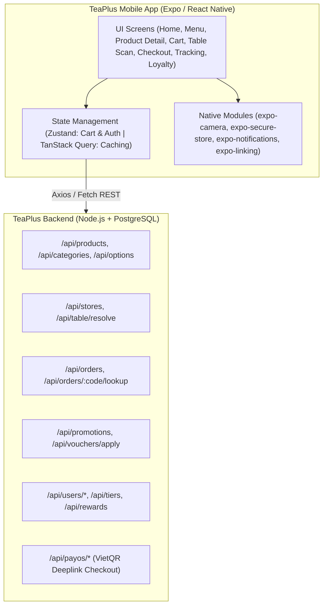

# Đặc tả Thiết kế Ứng dụng Di động TeaPlus Khách hàng (React Native / Expo)

> **Dự án:** TeaPlus Customer Mobile App (iOS & Android)  
> **Ngày lập:** 19/08/2026  
> **Tác giả:** AGY (Antigravity) & Đại ca  
> **Nền tảng:** React Native (Expo SDK 52+), TypeScript, NativeWind / Tailwind CSS, TanStack Query  
> **Backend:** Tái sử dụng 100% REST API 3 tầng PostgreSQL TeaPlus hiện có

---

## 1. Tầm nhìn & Mục tiêu sản phẩm

Ứng dụng di động **TeaPlus Khách Hàng** nhằm mang đến trải nghiệm đặt món trà trái cây hiện đại, nhanh chóng và mượt mà nhất trên điện thoại iOS và Android:
- **Tốc độ & Mượt mà:** Native 60-120fps, mở app tức thì, caching danh mục và ảnh bằng TanStack Query.
- **Quét QR tại bàn tức thì:** Quét camera tại bàn quán ➔ Nhận diện bàn & chi nhánh ➔ Tự động đặt món không cần đợi phục vụ.
- **Thanh toán VietQR App-to-App:** Tự động gọi sâu (Deeplink) mở ứng dụng ngân hàng trên điện thoại mà không cần chụp màn hình mã QR.
- **Thành viên & Tích điểm số:** Thẻ tích điểm barcode/QR quét tại quầy POS, đổi quà và săn voucher sinh nhật.
- **Theo dõi đơn hàng thời gian thực:** Animation timeline hiển thị từng bước pha chế từ Bếp KDS đến tay khách hàng.

---

## 2. Kiến trúc Ứng dụng Di động



---

## 3. Các Luồng Nghiệp vụ & Màn hình Chính

### 3.1. Màn hình Trang Chủ (Home / Discovery)
- **Top Bar:** Địa chỉ chi nhánh gần nhất (tự động gợi ý qua GPS), icon Thông báo & Giỏ hàng mini.
- **Carousel Banner:** Banner chương trình khuyến mãi, voucher hot, món mới theo mùa (Seasonal).
- **Phím tắt nhanh (Quick Actions):**
  - 📷 **Quét QR tại bàn**: Bật camera quét mã QR trên bàn quán.
  - 🛵 **Giao tận nơi (Delivery)**: Chọn địa chỉ giao hàng và danh sách món.
  - 🛍️ **Đến lấy tại quán (Takeaway)**: Đặt trước, hẹn giờ lấy món không phải chờ.
  - 🎁 **Đổi quà / Voucher**: Xem kho quà tích điểm.
- **Menu danh mục & Best-seller:** Danh sách tab (Trà trái cây, Trà sữa, Đá xay, Cà phê) cuộn ngang mượt mà.

### 3.2. Màn hình Thực Đơn & Chi tiết Món (Menu & Product Customizer)
- Bottom sheet / Modal tùy biến món cao cấp:
  - Chọn size: M, L, XL (tự động cộng giá theo phân loại).
  - Chọn đế trà: Trà Ô Long, Trà Lài, Trà Đen, Hồng Trà.
  - Chọn mức đường: 0%, 30%, 50%, 70%, 100%.
  - Chọn mức đá: Không đá, 30% đá, 50% đá, 100% đá.
  - Chọn topping: Trân châu trắng, Thạch nha đam, Thạch trái cây, Kem cheese...
  - Ghi chú riêng cho nhân viên pha chế.

### 3.3. Quét QR tại Bàn (Camera QR Table Resolver)
- Sử dụng `expo-camera` quét mã QR dạng `https://teaplus.vn/table?table_id=12` hoặc chuỗi ID.
- Tự động gọi API `GET /api/table/resolve?table_id=12`.
- Hiển thị Toast thông báo: *"Bạn đang ngồi tại Bàn 04 - Chi nhánh Quận 1"*.
- Khóa chế độ `order_type = 'DineIn'` và tự động gán `table_id` vào đơn hàng.

### 3.4. Giỏ hàng & Thanh toán (Cart & Checkout)
- Áp dụng Voucher khuyến mãi (Kiểm tra điều kiện `POST /api/vouchers/apply`).
- Tích hợp điểm thưởng (Dùng điểm đổi giảm giá).
- Phương thức thanh toán:
  - **VietQR / PayOS**: Sinh mã QR và hỗ trợ nút **"Mở ứng dụng Ngân hàng"** (VietQR Intent Deeplink vào hơn 30+ app ngân hàng VCB, MBBank, Techcombank...).
  - **Tiền mặt tại bàn / COD**.
- Chống spam / Retry an toàn bằng cơ chế `idempotency_key` đã xây dựng ở Backend.

### 3.5. Theo dõi Đơn Hàng (Order Tracking & History)
- Lấy thông tin qua `GET /api/orders/:orderCode/lookup`.
- Timeline trạng thái sống động:
  1. `received` (Đã tiếp nhận đơn).
  2. `preparing` (Bếp KDS đang pha chế).
  3. `delivering` (Tài xế đang giao) hoặc `ready` (Món đã sẵn sàng tại quầy).
  4. `completed` (Hoàn thành đơn hàng).
- Hỗ trợ nút gọi điện trực tiếp cho chi nhánh (`expo-linking`).

### 3.6. Hội Viên & Thẻ Thành Viên Số (Loyalty, Tiers & Rewards)
- Thẻ thành viên ảo: Hiển thị Hạng (Member, Silver, Gold, Diamond), điểm tích lũy hiện tại, thanh tiến trình thăng hạng.
- Mã vạch / QR cá nhân (Barcode/QR) để đưa thu ngân quét tại máy POS.
- Kho Voucher của tôi (`/api/users/:id/vouchers`) & Lịch sử tích/tiêu điểm.

---

## 4. Cấu trúc Dự án Đề xuất (`mobile/`)

```
Order/
├── backend/                   # Node.js + PostgreSQL (Đã hoàn thiện)
├── frontend/                  # Web TanStack Start (Đã hoàn thiện)
├── mobile/                    # Ứng dụng Di động React Native Expo
│   ├── app/                   # Expo Router Pages
│   │   ├── (tabs)/            # Bottom Tabs: Home, Menu, Orders, Loyalty, Profile
│   │   │   ├── index.tsx      # Trang chủ
│   │   │   ├── menu.tsx       # Thực đơn đầy đủ
│   │   │   ├── scan.tsx       # Quét QR tại bàn
│   │   │   ├── orders.tsx     # Lịch sử & Đơn đang làm
│   │   │   └── profile.tsx    # Tài khoản & Tích điểm
│   │   ├── product/[id].tsx   # Chi tiết & Tùy chọn món
│   │   ├── cart.tsx           # Giỏ hàng & Voucher
│   │   ├── checkout.tsx       # Thanh toán & VietQR Deeplink
│   │   ├── tracking/[code].tsx# Theo dõi đơn hàng
│   │   └── _layout.tsx
│   ├── components/            # UI Components (Button, Card, Badge, Header, Modal)
│   ├── hooks/                 # Custom React Hooks (useCart, useAuth, useProducts)
│   ├── lib/                   # API Client, Axios, Constants, Formatters
│   ├── store/                 # Zustand Stores (cartStore, authStore)
│   ├── app.json               # Cấu hình Expo App (Tên, Icon, Splash, Permissions)
│   ├── package.json
│   └── tsconfig.json
```

---

## 5. Lộ trình Triển khai Chi tiết (Phases)

| Giai đoạn | Nội dung công việc | Thời gian dự kiến |
|---|---|:---:|
| **Giai đoạn 1: Khởi tạo & Core UI** | Khởi tạo Expo SDK, cài đặt NativeWind/Tailwind, cấu hình Theme màu TeaPlus, kết nối API Client tới Backend PostgreSQL. | 1 ngày |
| **Giai đoạn 2: Menu & Giỏ Hàng** | Xây dựng màn hình Home, danh mục thực đơn, modal tùy biến món (đường, đá, topping), giỏ hàng Zustand lưu cục bộ. | 1 ngày |
| **Giai đoạn 3: Quét QR & Checkout PayOS** | Tích hợp Camera QR Scanner cho bàn, luồng thanh toán VietQR Deeplink & COD, tạo đơn hàng an toàn. | 1.5 ngày |
| **Giai đoạn 4: Tracking & Hội viên** | Màn hình theo dõi đơn hàng thời gian thực, thẻ thành viên Barcode/QR, đổi voucher và đánh giá món. | 1 ngày |
| **Giai đoạn 5: Build APK & Test iOS** | Build file cài đặt Android APK (EAS Build) và chạy thử nghiệm trên thiết bị thật. | 0.5 ngày |

---

## 6. Tiêu chí Nghiệm thu (Acceptance Criteria)

1. **Khởi chạy mượt mà:** Chạy được trên cả Expo Go lẫn Native Build (Android & iOS).
2. **Đồng bộ dữ liệu:** Menu món, giá, chi nhánh, voucher và đơn hàng lấy chính xác 100% từ Backend PostgreSQL hiện tại.
3. **Quét bàn chuẩn:** Quét mã QR tại bàn nhận đúng `table_id` và gán vào đơn hàng.
4. **Thanh toán tiện lợi:** Mở được mã VietQR PayOS và hỗ trợ chuyển khoản nhanh.
5. **UI bắt mắt:** Giao diện chuẩn mobile mượt mà, đúng nhận diện thương hiệu TeaPlus.
