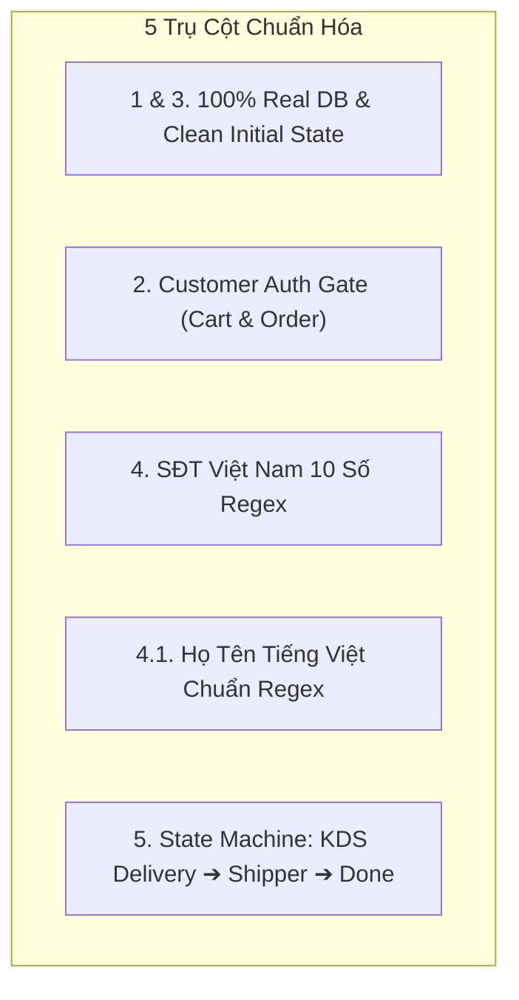
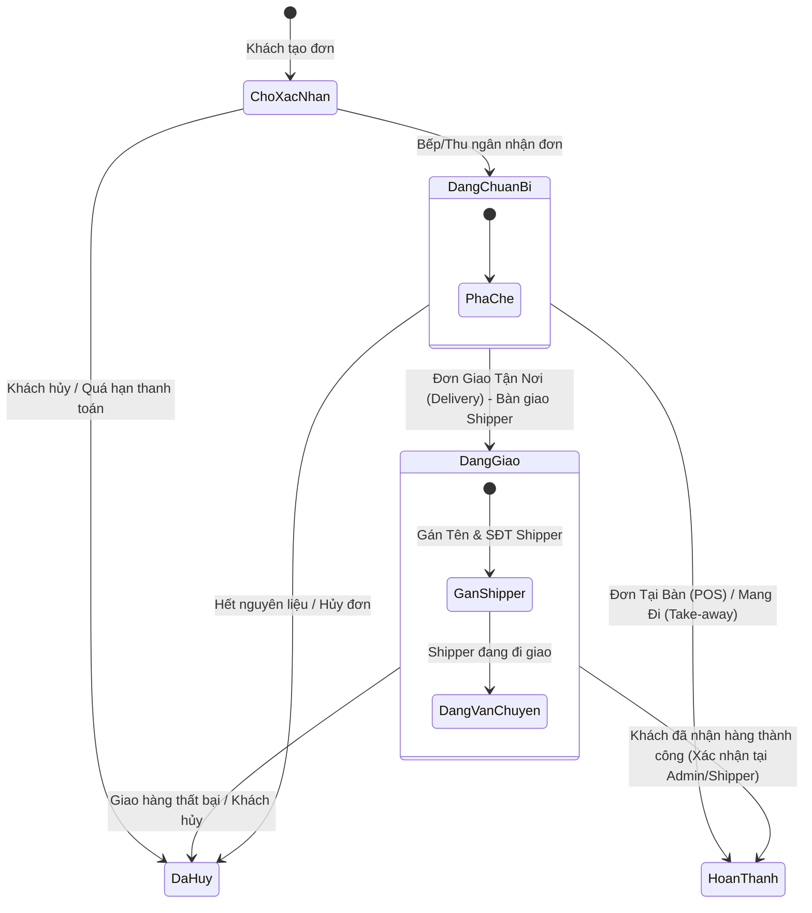

# Đặc Tả Thiết Kế: Chuẩn Hóa Toàn Vẹn Dữ Liệu, Xác Thực Khách Hàng, Ràng Buộc Form & Luồng KDS Delivery

> **Ngày tạo:** 22/08/2026  
> **Tác giả:** AGY Pair Programming Agent  
> **Kiểm toán viên / Người nghiệm thu:** Codex  
> **Trạng thái:** Đã được chủ dự án phê duyệt sơ bộ, sẵn sàng để lập Implementation Plan  

---

## 1. Bối Cảnh & Mục Tiêu

Hệ thống đặt món TeaPlus đã hoàn tất di chuyển PostgreSQL và tái cấu trúc Clean Architecture 3 tầng (Phase 3). Tuy nhiên, qua quá trình rà soát thực tế, hệ thống xuất hiện 5 vấn đề cốt lõi cần được xử lý triệt để:

1. **Dữ liệu ảo (Mock Data / Residue Data)**: Một số màn hình và `cart.tsx` vẫn còn sót initial mock state (ví dụ `wishlist` có sẵn `'tra-dau-tay'`), hoặc fallback trả dữ liệu ảo khi mất kết nối backend thay vì báo trạng thái sạch/lỗi rõ ràng.
2. **Thiếu Auth Gate cho Giỏ hàng & Đặt hàng**: Khách vãng lai (chưa đăng nhập) vẫn có thể thêm món vào giỏ và đặt hàng mà chưa xác định được chủ sở hữu.
3. **Trạng thái dữ liệu ban đầu chưa sạch**: Khách mới vào chưa đăng nhập phải có profile rỗng, không có đơn hàng cũ, không có yêu thích ảo; chỉ hiển thị thực đơn thật lấy từ database của Admin.
4. **Thiếu ràng buộc Số điện thoại**: Chưa kiểm tra định dạng 10 chữ số chuẩn của các nhà mạng Việt Nam (`03, 05, 07, 08, 09` hoặc `+84`).
5. **Thiếu ràng buộc Họ và Tên tiếng Việt**: Chưa có regex kiểm tra viết hoa chữ cái đầu và chặn số/ký tự đặc biệt.
6. **Lỗi logic đơn Delivery trên màn hình Bếp (KDS)**: Khi Bếp pha chế xong đơn giao tận nơi (`Delivery`), nút bấm KDS nhảy cóc sang `Hoàn thành` thay vì chuyển sang `Đang giao` (bàn giao Shipper), làm mất giai đoạn gán tài xế và theo dõi hành trình.

---

## 2. Đặc Tả Chi Tiết 5 Vấn Đề



---

### 2.1. Vấn đề 1 & 3: Thanh Lọc Dữ Liệu & Khởi Tạo Trạng Thái Sạch (Clean State)

#### Hiện trạng
* [`frontend/src/lib/cart.tsx#L34`](file:///D:/Code/Extra/Planning_DuAn/Order/frontend/src/lib/cart.tsx#L34): Khởi tạo `wishlist` với dữ liệu hardcode `['tra-dau-tay']`.
* `mock-engine.ts`: Chứa các hàm sinh đơn hàng ảo và user ảo trong `localStorage`.

#### Thiết kế Chuẩn hóa
* **Khởi tạo sạch**:
  * `wishlist` ban đầu là `[]`. Chỉ lưu và nạp wishlist theo ID của user đã đăng nhập.
  * Khi chưa đăng nhập: Không có đơn hàng cũ, profile là `null`, danh sách yêu thích là `[]`.
* **Quy tắc Fetch Dữ liệu**:
  * **Dữ liệu Động (CRUD & Events)**: *Sản phẩm, Danh mục, Chi nhánh, Khuyến mãi, Tồn kho, Bàn, Đơn hàng, Profile, Thông báo* **bắt buộc 100% gọi API PostgreSQL thật**.
  * Khi Backend ngắt kết nối hoặc trả lỗi 5xx: Hiển thị Error State / Empty State an toàn, **tuyệt đối không âm thầm nạp mock data fake**.
  * **Dữ liệu Tĩnh**: Chỉ cho phép nạp asset tĩnh không thay đổi (Ảnh banner Hero, Logo thương hiệu, Icon hệ thống).

---

### 2.2. Vấn đề 2: Bắt Buộc Đăng Nhập / Đăng Ký (Auth Gate for Cart & Checkout)

#### Hiện trạng
* Khách hàng chưa đăng nhập (`customerToken == null`) vẫn bấm được nút "Thêm vào giỏ" và tiến hành tạo đơn hàng.

#### Thiết kế Chuẩn hóa
1. **Chặn tại Menu & Modal Món**:
   * Khi khách bấm `"Thêm vào giỏ"` hoặc `"Đặt ngay"` trên [`frontend/src/routes/menu.tsx`](file:///D:/Code/Extra/Planning_DuAn/Order/frontend/src/routes/menu.tsx):
   * Kiểm tra `getCustomerToken()`. Nếu chưa có:
     * Phát thông báo: `"Vui lòng đăng nhập hoặc đăng ký tài khoản để bắt đầu đặt món"`.
     * Tự động mở Modal Đăng ký / Đăng nhập nhanh hoặc chuyển hướng sang trang xác thực, lưu lại item đang chọn để tiếp tục sau khi đăng nhập thành công.
2. **Chặn tại Cart Context**:
   * Trong [`frontend/src/lib/cart.tsx`](file:///D:/Code/Extra/Planning_DuAn/Order/frontend/src/lib/cart.tsx): Hàm `addItem` kiểm tra token; nếu chưa xác thực sẽ chặn cập nhật state giỏ hàng.
3. **Chặn tại Backend**:
   * API `POST /api/orders` bắt buộc phải có Bearer token của Customer (`req.user` phải tồn tại), từ chối đơn hàng anonymous.

---

### 2.3. Vấn đề 4 & 4.1: Ràng Buộc Validation Form (SĐT & Họ Tên)

#### A. Ràng buộc Số điện thoại (Việt Nam)
* **Quy chuẩn**:
  * Bắt buộc đúng **10 chữ số** (sau khi chuẩn hóa từ `+84` hoặc `84` thành `0`).
  * Phải thuộc các dải đầu số hợp lệ của các nhà mạng tại Việt Nam: `03x`, `05x`, `07x`, `08x`, `09x`.
* **Biểu thức chính quy (Regex)**:
  ```regex
  ^(0)(3[2-9]|5[25689]|7[06-9]|8[1-9]|9[0-9])[0-9]{7}$
  ```

#### B. Ràng buộc Họ và Tên (Tiếng Việt Chuẩn)
* **Quy chuẩn**:
  * Tối thiểu 2 từ (ví dụ: *"Nguyễn Du"*, *"Trần Thị Mai"*).
  * Mỗi từ phải **viết hoa chữ cái đầu**, theo sau là các chữ cái viết thường.
  * Chỉ chấp nhận ký tự bảng chữ cái tiếng Việt Unicode có dấu và khoảng trắng đơn phân tách giữa các từ.
  * Không chứa chữ số, không chứa ký tự đặc biệt, không có khoảng trắng thừa ở đầu/cuối hoặc giữa các từ.
* **Biểu thức chính quy (Regex)**:
  ```regex
  ^([A-Z\u00C0-\u00FF\u0102\u0103\u0110\u0111\u01A0\u01A1\u01AF\u01B0\u1EA0-\u1EF9][a-z\u00C0-\u00FF\u0102\u0103\u0110\u0111\u01A0\u01A1\u01AF\u01B0\u1EA0-\u1EF9]*)(\s([A-Z\u00C0-\u00FF\u0102\u0103\u0110\u0111\u01A0\u01A1\u01AF\u01B0\u1EA0-\u1EF9][a-z\u00C0-\u00FF\u0102\u0103\u0110\u0111\u01A0\u01A1\u01AF\u01B0\u1EA0-\u1EF9]*))+$
  ```

#### C. Các vị trí áp dụng đồng bộ:
* **Frontend**:
  * Form Đăng ký tài khoản khách hàng.
  * Form Cập nhật thông tin cá nhân trong Hồ sơ.
  * Form Thông tin người nhận tại trang Thanh toán (`thanh-toan.tsx`).
* **Backend**:
  * [`backend/validation/customer-schemas.js`](file:///D:/Code/Extra/Planning_DuAn/Order/backend/validation/customer-schemas.js): `validateCustomerRegisterInput`, `validateCustomerProfileUpdate`.
  * [`backend/validation/order-schemas.js`](file:///D:/Code/Extra/Planning_DuAn/Order/backend/validation/order-schemas.js): `validateCreateOrderInput`.
  * [`backend/routes/customerAuth.js`](file:///D:/Code/Extra/Planning_DuAn/Order/backend/routes/customerAuth.js): Xác thực trước khi lưu DB.

---

### 2.4. Vấn đề 5: Logic Đơn Hàng Giao Xa (Delivery), Màn Hình Bếp KDS & Điều Phối Shipper

#### Hiện trạng lỗi logic
Trên màn hình KDS ([`admin.bep.tsx`](file:///D:/Code/Extra/Planning_DuAn/Order/frontend/src/routes/admin.bep.tsx)), khi đơn hàng ở cột `"🔴 Đang chuẩn bị"`, bấm nút `"Hoàn thành"` sẽ gửi API chuyển status thẳng thành `"Hoàn thành"`. Đối với đơn `Delivery`, đơn bị đóng ngay khi vừa pha xong, shipper chưa kịp nhận đơn và không có thông tin tài xế.

#### Ma Trận Chuyển Đổi Trạng Thái (State Transition Matrix)

| Loại Đơn (`order_type`) | Khi Bếp bấm Xong | Trạng thái Chuyển đến | Giao diện KDS / Hành động tiếp theo |
|---|---|---|---|
| **Tại bàn (`POS`/`Dine-in`)** | Bấm `"Hoàn thành"` | `Hoàn thành` | Món sẵn sàng phục vụ tại bàn |
| **Mang đi (`Take-away`)** | Bấm `"Hoàn thành"` | `Hoàn thành` | Khách nhận món tại quầy |
| **Giao tận nơi (`Delivery`)** | Bấm `"Pha xong ➔ Giao Shipper"` | **`Đang giao`** | • Chuyển trạng thái sang `Đang giao`<br>• Mở Dialog gán nhanh Shipper (Tên tài xế, SĐT, Link lộ trình) hoặc chuyển sang danh sách chờ điều phối của Admin |



#### Thiết kế Giao diện & Hành vi:
1. **Tại KDS (`admin.bep.tsx`)**:
   * Kiểm tra thuộc tính `order_type` của thẻ đơn:
     * Nếu `order_type === 'Delivery'`: Hiển thị nút màu cam/xanh dương: `"🚚 Pha xong ➔ Giao Shipper"`.
     * Khi bấm: Mở `Dialog` bàn giao Shipper (nhập Tên tài xế, SĐT tài xế - có thể bỏ trống để Admin gán sau). Gọi `PATCH /api/admin/orders/:id/status` với target `status: 'Đang giao'`.
     * Nếu `order_type !== 'Delivery'`: Hiển thị nút `"✅ Hoàn thành"`, gọi `PATCH /api/admin/orders/:id/status` với `status: 'Hoàn thành'`.
2. **Tại Quản lý Đơn hàng Admin (`admin.don-hang.tsx`)**:
   * Giữ nguyên và hoàn thiện bộ form chỉnh sửa Shipper (`driver_name`, `driver_phone`, `tracking_url`).
   * Bổ sung nút xác nhận `"Đã giao thành công ➔ Hoàn thành"` dành riêng cho các đơn đang ở trạng thái `Đang giao`.
3. **Tại Trang Live Tracking Khách hàng (`theo-doi-don.tsx`)**:
   * Hiển thị thông tin Shipper (nếu có) khi đơn chuyển sang bước 2 (`Đang giao`): *"Tài xế: Nguyễn Văn A (0988xxx) đang giao hàng đến bạn"*.

---

## 3. Danh Sách Tệp Cần Chỉnh Sửa

| Tệp | Phạm vi Thay đổi |
|---|---|
| [`backend/validation/customer-schemas.js`](file:///D:/Code/Extra/Planning_DuAn/Order/backend/validation/customer-schemas.js) | Thêm validator SĐT chuẩn VN 10 số & Họ tên tiếng Việt Regex |
| [`backend/validation/order-schemas.js`](file:///D:/Code/Extra/Planning_DuAn/Order/backend/validation/order-schemas.js) | Ràng buộc SĐT và Họ tên người nhận theo Regex mới |
| [`backend/routes/customerAuth.js`](file:///D:/Code/Extra/Planning_DuAn/Order/backend/routes/customerAuth.js) | Áp dụng validator SĐT & Họ tên mới, trả mã lỗi 400 rõ ràng |
| [`backend/routes/public/orders.js`](file:///D:/Code/Extra/Planning_DuAn/Order/backend/routes/public/orders.js) | Yêu cầu xác thực Customer JWT khi tạo đơn hàng |
| [`frontend/src/lib/cart.tsx`](file:///D:/Code/Extra/Planning_DuAn/Order/frontend/src/lib/cart.tsx) | Xóa bỏ `wishlist` hardcode, thêm Auth Gate kiểm tra token khi `addItem` |
| [`frontend/src/routes/menu.tsx`](file:///D:/Code/Extra/Planning_DuAn/Order/frontend/src/routes/menu.tsx) | Chặn khách chưa đăng nhập bấm thêm giỏ / đặt món |
| [`frontend/src/routes/admin.bep.tsx`](file:///D:/Code/Extra/Planning_DuAn/Order/frontend/src/routes/admin.bep.tsx) | Phân tách nút hoàn tất cho đơn `Delivery` (`Đang giao`) vs `POS`/`Take-away` (`Hoàn thành`), thêm modal bàn giao Shipper |
| [`frontend/src/routes/admin.don-hang.tsx`](file:///D:/Code/Extra/Planning_DuAn/Order/frontend/src/routes/admin.don-hang.tsx) | Bổ sung nút xác nhận hoàn thành từ bước `Đang giao` |
| [`frontend/src/routes/ho-so.tsx`](file:///D:/Code/Extra/Planning_DuAn/Order/frontend/src/routes/ho-so.tsx) | Áp dụng validation form họ tên & SĐT khi cập nhật profile |
| [`frontend/src/routes/thanh-toan.tsx`](file:///D:/Code/Extra/Planning_DuAn/Order/frontend/src/routes/thanh-toan.tsx) | Áp dụng validation form SĐT & Họ tên người nhận theo chuẩn mới |

---

## 4. Tiêu Chuẩn Nghiệm Thu Dành Cho Codex (Acceptance Checklist)

- [ ] **Validation SĐT VN**: 100% test cases SĐT đúng 10 số đầu mạng VN (`03, 05, 07, 08, 09`) PASS; các số 9 số, 11 số, đầu số không tồn tại bị từ chối với status 400.
- [ ] **Validation Họ Tên**: Các họ tên tiếng Việt viết hoa đúng cấu trúc PASS; tên có số, ký tự đặc biệt, 1 từ hoặc viết hoa lộn xộn bị từ chối 400.
- [ ] **Auth Gate**: Khách chưa login không thể thêm item vào giỏ hàng hoặc gọi API tạo đơn thành công.
- [ ] **Clean State**: Reset sạch wishlist và orders ban đầu; không có dữ liệu ảo xuất hiện khi người dùng mới truy cập.
- [ ] **KDS Delivery Flow**: Đơn `Delivery` khi bấm hoàn tất pha chế tại KDS bắt buộc chuyển sang `Đang giao`, không được nhảy cóc sang `Hoàn thành`.
- [ ] **Test Suite Green**: `npm test` backend và `vitest run` frontend đạt 100% PASS không lỗi hồi quy.
