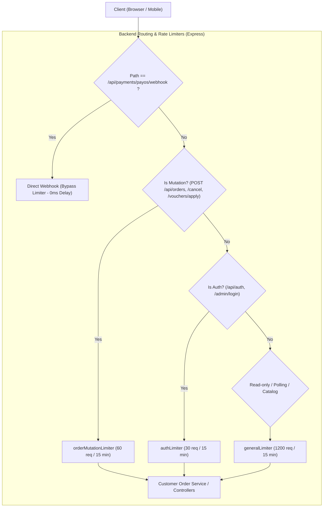

# Thiết Kế Kiến Trúc: Phân Tầng Rate Limiting & Tối Ưu Polling Tránh Lỗi 429 (Too Many Requests)

**Tác giả**: Antigravity (AGY)  
**Ngày**: 23/08/2026  
**Trạng thái**: Draft / Chờ Codex & Đại ca duyệt

---

## 1. Bối Cảnh & Phân Tích Nguyên Nhân Gốc (Root Cause Analysis)

### 1.1 Hiện tượng
Khi người dùng đặt hàng online (đặc biệt là thanh toán PayOS VietQR) hoặc vừa vào màn hình theo dõi đơn:
- Sau khoảng **60 giây** chờ thanh toán hoặc theo dõi, hệ thống bắt đầu báo lỗi **`HTTP 429: Quá nhiều yêu cầu, vui lòng thử lại sau 15 phút`**.
- Khách hàng bị chặn toàn bộ thao tác tra cứu đơn hàng và tạo đơn mới trong 15 phút tiếp theo.

### 1.2 Nguyên nhân gốc trong mã nguồn
1. **Lỗi gán Rate Limiter sai phạm vi (Prefix-matching Trap)**:
   Trong [`backend/app.js`](file:///D:/Code/Extra/Planning_DuAn/Order/backend/app.js#L84-L92):
   ```javascript
   const sensitiveLimiter = rateLimit({
     windowMs: 15 * 60 * 1000,
     max: 20, // 20 requests / 15 phút
     message: { error: 'Quá nhiều yêu cầu, vui lòng thử lại sau 15 phút' },
   });

   app.use('/api/orders', sensitiveLimiter); // Gán cho toàn bộ prefix /api/orders
   ```
   Khi dùng `app.use('/api/orders', sensitiveLimiter)`, Express áp dụng giới hạn **20 request / 15 phút** cho **TẤT CẢ** các endpoint bắt đầu bằng `/api/orders`, bao gồm cả:
   - `POST /api/orders` (Tạo đơn)
   - `GET /api/orders/lookup?code=...` (Tra cứu polling đơn hàng)
   - `GET /api/orders/track?code=...` (Tra cứu lịch sử timeline)

2. **Xung đột với chu kỳ Polling của Frontend**:
   - Tại [`frontend/src/routes/thanh-toan.tsx`](file:///D:/Code/Extra/Planning_DuAn/Order/frontend/src/routes/thanh-toan.tsx): Polling kiểm tra trạng thái đơn qua `GET /api/orders/lookup` chạy mỗi **3 giây/lần** (tương đương 20 requests / phút).
   - Chỉ sau **60 giây** (20 requests), khách hàng đã chạm trần `sensitiveLimiter` $\rightarrow$ Request thứ 21 lập tức nhận mã lỗi **`429 Too Many Requests`**.

3. **Trần `generalLimiter` chưa tính đến Polling dài hạn**:
   - `generalLimiter` được đặt ở mức `max: 300` req / 15 phút. Khách hàng bật màn hình QR hoặc theo dõi đơn trong 15 phút ($15 \times 60 / 3 = 300$ reqs) cũng sẽ chạm trần này nếu mở nhiều tab hoặc duyệt catalog.

4. **Frontend Polling chưa có cơ chế ngủ (Idle/Terminal State Awareness)**:
   - `thanh-toan.tsx` vẫn tiếp tục poll khi QR đã hết hạn 15 phút.
   - `theo-doi-don.tsx` vẫn duy trì `setInterval 5s` ngay cả khi đơn đã `Hoàn thành` hoặc `Đã hủy`.
   - Polling vẫn chạy khi tab bị ẩn (`document.hidden`).

---

## 2. Mục Tiêu & Yêu Cầu Thiết Kế

1. **Phân tầng rành mạch (Separation of Concerns)**:
   - **Tạo/Hủy đơn & Đăng nhập (Mutation)**: Giữ chặt chẽ rate limit để chống spam/DDoS/Brute-force.
   - **Tra cứu trạng thái (Read-only Polling)**: Cho phép tần suất cao, thông suốt không bao giờ bị nghẽn 429 khi khách hàng đang giao dịch.
2. **Tiết kiệm tài nguyên (Smart Polling Lifecycle)**:
   - Frontend tự động dừng/ngủ polling khi đơn đã kết thúc (`Hoàn thành`, `Đã hủy`), khi mã QR đã hết hạn, hoặc khi tab trình duyệt chuyển sang background.
3. **Bảo mật & Ổn định**:
   - Trả đầy đủ chuẩn headers `RateLimit-*`.
   - Xử lý lỗi 429 tại client nhẹ nhàng (exponential backoff) nếu có nghẽn mạng đột biến.

---

## 3. Kiến Trúc Giải Pháp Chi Tiết



### 3.1 Cấu Hình Rate Limiter Phân Tầng tại `backend/app.js`

```javascript
// 1. General Limiter (Duyệt web, danh mục, menu, và polling tra cứu đơn hàng)
const generalLimiter = rateLimit({
  windowMs: 15 * 60 * 1000, // 15 phút
  max: 1200, // 1200 requests / 15 phút (tương đương 80 reqs/phút, đủ cho 3s/5s polling liên tục)
  standardHeaders: true,
  legacyHeaders: false,
  message: { error: 'Quá nhiều yêu cầu, vui lòng thử lại sau' },
});

// 2. Order Mutation Limiter (Chỉ áp dụng cho tạo đơn, hủy đơn, áp voucher)
const orderMutationLimiter = rateLimit({
  windowMs: 15 * 60 * 1000,
  max: 60, // Tối đa 60 lần tạo/hủy đơn / 15 phút trên 1 IP
  standardHeaders: true,
  legacyHeaders: false,
  message: { error: 'Quá nhiều thao tác tạo/hủy đơn hàng, vui lòng thử lại sau 15 phút' },
});

// 3. Auth Limiter (Chỉ áp dụng cho đăng nhập, đăng ký, OTP)
const authLimiter = rateLimit({
  windowMs: 15 * 60 * 1000,
  max: 30, // 30 lần thử / 15 phút
  standardHeaders: true,
  legacyHeaders: false,
  message: { error: 'Quá nhiều yêu cầu xác thực, vui lòng thử lại sau 15 phút' },
});

// GẮN CHÍNH XÁC ROUTE & METHOD CỤ THỂ:
app.post('/api/orders', orderMutationLimiter);
app.post('/api/orders/cancel', orderMutationLimiter);
app.post('/api/orders/:id/cancel', orderMutationLimiter);
app.post('/api/vouchers/apply', orderMutationLimiter);

app.use('/admin/login', authLimiter);
app.use('/api/auth', authLimiter);

// Toàn bộ các route GET tra cứu (/api/orders/lookup, /api/payments/payos/status, catalog...)
// sẽ đi qua generalLimiter (1200 reqs / 15 min)
app.use('/api', generalLimiter);
```

### 3.2 Tối Ưu Vòng Đời Polling tại Frontend

1. **Tại `frontend/src/routes/thanh-toan.tsx`**:
   - Dừng polling khi `countdownSec <= 0` (hết hạn QR).
   - Tự động tạm dừng khi chuyển tab (`document.visibilityState === 'hidden'`) và kích hoạt kiểm tra ngay khi quay lại tab (`visibilitychange`).
   - Dừng hoàn toàn khi `payment_status === 'paid'`.

2. **Tại `frontend/src/routes/theo-doi-don.tsx`**:
   - Dừng polling khi đơn ở trạng thái kết thúc (`current_status === 'Hoàn thành' || current_status === 'Đã hủy'`).
   - Tạm dừng polling khi tab bị ẩn.

---

## 3.3. Quyết Định Bổ Sung Sau Review Codex

1. **Tách polling khỏi general limiter**: tạo `pollingLimiter` riêng cho `GET /api/orders/lookup` và `GET /api/payments/payos/status`. Không nâng general limiter lên mức cao để bù cho polling.
2. **Không áp limiter chồng ngoài ý muốn**: mutation/auth được áp limiter riêng; general limiter phải bỏ qua các route đã có limiter chuyên biệt hoặc có test xác nhận rõ hành vi double-limit và headers.
3. **Giới hạn polling theo ngữ cảnh**: key polling tối thiểu gồm IP và mã đơn đã chuẩn hóa; không cho một IP dùng một mã đơn để tạo tải vô hạn. Không trả thêm PII khi nới giới hạn tra cứu.
4. **Polling frontend dùng chained timeout** thay vì `setInterval` phụ thuộc trực tiếp vào `countdownSec`/state. Mỗi lần request hoàn tất mới lên lịch request kế tiếp, tránh request chồng nhau.
5. **Backoff và visibility**: khi gặp `429`, `5xx` hoặc lỗi mạng, tăng khoảng chờ theo exponential backoff có trần; khi tab ẩn thì hủy timeout, khi tab hiện lại gọi một request ngay rồi khởi động lại chu kỳ.
6. **Trạng thái dừng polling**: dừng khi `paid` và trạng thái terminal, `expired`, `Hoàn thành`, `Đã hủy`, `404` hoặc `403`.

## 4. Kế Hoạch Kiểm Thử & Nghiệm Thu (Acceptance Criteria)

- [ ] Polling `GET /api/orders/lookup?code=...` liên tục 3s trong 10 phút (>200 requests) không bị trả về HTTP 429.
- [ ] Polling dùng limiter riêng; catalog/general limiter không làm thay đổi ngân sách polling và không có double-limit ngoài thiết kế.
- [ ] Endpoint `POST /api/orders` (Tạo đơn) vẫn được bảo vệ chống spam (giới hạn 60 req / 15 min).
- [ ] Endpoint `POST /api/auth/login` và OTP vẫn được bảo vệ chống brute force (giới hạn 30 req / 15 min).
- [ ] Frontend `thanh-toan.tsx` tự dừng polling khi hết hạn 15 phút hoặc khi đơn đã `paid`.
- [ ] Frontend `theo-doi-don.tsx` tự dừng polling khi đơn đã `Hoàn thành` hoặc `Đã hủy`.
- [ ] Polling không tạo request chồng nhau; 429/5xx/network error kích hoạt backoff có trần.
- [ ] Tab ẩn không phát sinh request polling; tab hiện lại kiểm tra ngay một lần.
- [ ] Lookup rate limit không làm lộ PII hoặc mở rộng khả năng đoán mã đơn.
- [ ] Bộ kiểm thử `npm test` backend và `npm test` frontend pass 100%.
