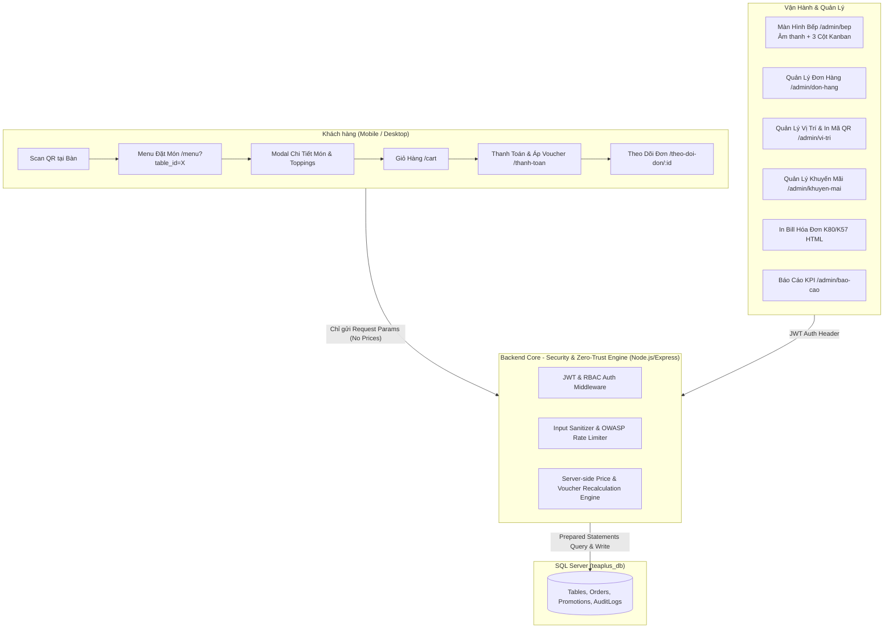

# MASTER PLAN.MD — KẾ HOẠCH PHÁT TRIỂN HỆ THỐNG ORDER STORE (TEA PLUS / JUICEBOX)

> Document tổng hợp từ: **Bản thiết kế ban đầu (JUICY_PROMPT.md)**, **SRS Chi tiết Client & Admin (Order2.md)**, **Hiện trạng Codebase**, **Yêu cầu bổ sung của Giảng viên (Requirment.md & ARCHITECTURE.md)** cùng **Quy tắc An ninh Bảo mật OWASP & Zero-Trust Backend Engine**.
>
> **🛠️ Kiến trúc chuẩn hiện tại: Node.js/Express + SQL Server** (xem Mục 4). Tài liệu C# Clean Architecture (`ARCHITECTURE.md`) là **roadmap tương lai**, chưa áp dụng cho giai đoạn này.
>
> **🎯 Ưu tiên hàng đầu (theo giảng viên): ĐƠN HÀNG CHẠY ĐƯỢC, kết nối toàn hệ thống** — QR vị trí → đặt món → bếp → in bill → báo cáo.

---

## 🔒 1. QUY TẮC AN NINH BẢO MẬT & PHÂN CẤP XỬ LÝ (ZERO-TRUST ARCHITECTURE & OWASP)

> [!CAUTION]
> **TẬP TRUNG AN TOÀN TUYỆT ĐỐI**: KHÔNG BAO GIỜ TIN TƯỞNG DỮ LIỆU GỬI TỪ FRONTEND.

### 1.1. Quy tắc Tính toán & Lưu trữ Dữ liệu (Zero-Trust Business Logic)
- Frontend chỉ gửi "Ý định" (Intent parameters): `product_id`, `size_id`, `topping_ids`, `sugar_level`, `ice_level`, `qty`, `voucher_code`, `table_id`.
- 🛑 **TUYỆT ĐỐI KHÔNG**: Frontend KHÔNG ĐƯỢC PHÉP gửi `unit_price`, `subtotal`, `discount_amount`, `total_amount` hay `total` lên server để lưu DB.
- **Backend làm chủ hoàn toàn việc Tính toán**: Server query DB lấy giá niêm yết, tự tính toán `line_total`, `subtotal`, `discount_amount`, `total` chuẩn xác trước khi lưu DB.

### 1.2. Tuân thủ Chuẩn Bảo mật OWASP Top 10
- [x] **Chống SQL Injection (A03:2021-Injection)**: 100% câu lệnh truy vấn SQL Server sử dụng Prepared Statements / Parameterized Queries (`@param`).
- [ ] **Xác thực & Phân quyền chuẩn RBAC (A01:2021-Broken Access Control)**: JWT Token & Auth Middleware kiểm tra quyền (`super`, `manager`, `kitchen`, `cashier`) tại các API `/admin/*`. Khách chỉ được truy cập đơn hàng của chính mình.
- [ ] **Mã hóa Mật khẩu (A02:2021-Cryptographic Failures)**: Bcrypt hashing (salting factor >= 10). Mã QR token của Bàn được tạo ngẫu nhiên bằng chuỗi ngẫu nhiên bảo mật cao.
- [ ] **Chống Brute-force & Dùng quá tải (A04:2021-Insecure Design)**: Express Rate Limiting tại các endpoint nhạy cảm (`POST /api/orders`, `POST /api/vouchers/apply`, `POST /admin/login`).
- [ ] **Security Headers & CORS (A05:2021-Security Misconfiguration)**: Helmet.js bảo vệ HTTP Headers + CORS Policy chỉ cho phép Frontend domain.
- [ ] **Audit Log (A09:2021-Security Logging)**: Tự động ghi lại các thao tác admin nhạy cảm vào bảng `audit_logs`.

### 1.3. Quy Tắc Triệt Tiêu Lỗi Logic & Xử Lý Edge Cases (Technical Logic Guardrails)
1. **SQL Server Transaction Atomic khi Đặt Hàng**:
   - API `POST /api/orders` phải bọc trong `sql.Transaction`. Nếu có bất kỳ lỗi nào ở bước lưu món, topping, lịch sử đơn hay voucher -> Gọi `ROLLBACK` ngay lập tức, không để lại đơn rác.
2. **Chống Lạm Dụng Voucher Tranh Chấp (Race Condition)**:
   - Cập nhật số lượt dùng bằng UPDATE Atomic: `UPDATE promotions SET used_count = used_count + 1 WHERE id = @id AND (usage_limit IS NULL OR used_count < usage_limit)`.
   - Nếu `rowsAffected === 0` -> Thất bại ngay, rollback transaction và báo *"Voucher đã hết lượt"*.
3. **Công Thức Tính Giá Server-Side & Giới Hạn Ép Trần**:
   - `unit_price = product_price + size_extra_price`.
   - `line_total = (unit_price + sum(topping_prices)) * qty`.
   - `subtotal = sum(line_total)`.
   - Giảm giá %: `calculated_discount = Math.round(subtotal * (discount_percent / 100))`.
   - Ép trần `max_discount`: `discount_amount = max_discount ? Math.min(calculated_discount, max_discount) : calculated_discount`.
   - `total = Math.max(0, subtotal - discount_amount)` (Đảm bảo tổng tiền không bao giờ âm).
4. **Hỗ Trợ Khách Vãng Lai Quét QR Không Cần Đăng Nhập**:
   - CSDL bảng `orders` cho phép `user_id` NULL. Khách quét QR bàn có thể đặt món trực tiếp mượt mà mà không bắt buộc tạo tài khoản.
5. **Khớp Chuẩn Chuỗi Trạng Thái SQL CHECK Constraint**:
   - Trạng thái đơn bắt buộc khớp 100% với SQL Server: `N'Chờ xác nhận'`, `N'Đã xác nhận'`, `N'Đang chuẩn bị'`, `N'Đang giao'`, `N'Hoàn thành'`, `N'Đã hủy'`.
6. **Mã Đơn Hàng Duy Nhất (Unique Order Code)**:
   - Công thức `order_code`: `TP` + [YYMMDD] + [4 số ngẫu nhiên] (VD: `TP2608058921`), có kiểm tra trùng lặp.
7. **Phân Định Rõ API Route Public vs Protected**:
   - **Public**: Xem Menu, Chi tiết món, Lấy thông tin bàn từ mã QR (`GET /api/table/resolve`), Đặt hàng (`POST /api/orders`), Kiểm tra mã voucher (`POST /api/vouchers/apply`).
   - **Protected Admin (Cần JWT + RBAC)**: Tất cả API `/admin/*` ngoại trừ `POST /admin/login`.

---

## 📱 2. CHI TIẾT PHẠM VI GIAO DIỆN KHÁCH HÀNG (CLIENT SITE SPECS)

### 2.1. Thành Phần Cố Định (Global Components)
- **Header (Sticky Glassmorphism)**:
  - Bộ chọn Chi nhánh & Vị trí nhận hàng.
  - Logo TeaPlus (Click quay về Trang chủ).
  - Thanh tìm kiếm Auto-suggest (tìm theo tên món, cốt trà lục trà/ô long, dâu/xoài/cam/sả/đào, topping).
  - Cụm nút Action: Notification Badge, Wishlist Heart, Cart Badge (hover/click mở Quick Cart Slide-over), Profile Dropdown (đơn hàng, đăng xuất).
  - Mobile Drawer & **Mobile Bottom Sticky Cart Bar** (thanh cố định đáy hiển thị tổng tiền + nút thanh toán trên mobile).
- **Footer**: Thông tin thương hiệu, giấy phép, hotline, chính sách bảo mật/giao hàng, mạng xã hội, QR app.
- **Floating Widgets**: Nút Gọi Hotline, Chat Zalo/Messenger, Nút cuộn trang Back-to-Top.

### 2.2. Chi Tiết Các Trang Client
1. 🏠 **Trang Chủ (`/`)**:
   - Hero Carousel Slider (Bộ sưu tập trà trái cây theo mùa, nút CTA đặt món).
   - Cam kết chất lượng (100% Trái cây tươi | Không chất bảo quản | ATVSTP).
   - Best Seller Grid (`🔥 Best Seller`, `🍊 Hàng Mới`).
   - Banner ưu đãi Flash Sale / Combo.
   - Customer Reviews carousel & Instagram teaser grid.
2. 🧃 **Trang Menu (`/menu`) — Màn Hình Đặt Món Trung Tâm**:
   - Thanh lọc theo Dòng trà (Lục trà, Ô long, Trà trái cây tuyết, Hi-Tea Detox) & Trái cây (Cam/Sả, Dâu/Nho, Đào/Vải, Xoài/Chanh Dây, Dưa Hấu/Táo).
   - **Tích hợp Quét QR Bàn**: Nhận tham số `?table_id=X` từ URL, hiển thị Banner nổi bật: `📍 Bạn đang ngồi tại: Bàn 05 (Chi nhánh Q1)`.
3. 🍵 **Popup Modal Tùy Chỉnh Ly Trà (Product Customization Modal)**:
   - Ảnh HD sản phẩm, Mô tả vị trà, Lượng Calories ước tính.
   - Chọn Size (Radio): Size M (Chuẩn) / Size L (+10k).
   - Chọn Cốt Trà Nền (Radio): Lục Trà Lài / Trà Ô Long / Trà Đen.
   - Chọn Mức Ngọt (Radio): 0%, 30%, 50%, 70%, 100% (Mặc định), Ngọt tự nhiên trái cây.
   - Chọn Mức Đá (Radio): Không đá, 30%, 50%, 70%, 100% (Mặc định), Đá riêng.
   - Chọn Toppings (Multi-select Checkbox + Giá): Trái cây dầm tươi, Thạch nha đam, Thạch trái cây, Trân châu trắng, Aloe Vera, Macchiato kem cheese.
   - Ghi chú cho Barista (Văn bản tự do).
   - Bộ chỉnh số lượng `[-] 1 [+]` & Nút *"Thêm vào giỏ hàng - [Giá tự động tính]"*.
4. 🏪 **Trang Cửa Hàng (`/cua-hang`)**:
   - Bộ lọc Tỉnh/Thành -> Quận/Huyện.
   - Nút GPS "Tìm chi nhánh gần tôi nhất".
   - Bản đồ tương tác Google Maps embed.
   - Thẻ cửa hàng: Địa chỉ, giờ mở cửa, hotline, tiện ích (chỗ đỗ ô tô, máy lạnh, mua mang đi), nút Chỉ đường & "Đặt giao từ chi nhánh này".
5. 💼 **Trang Tuyển Dụng (`/tuyen-dung`)** *(ngoài lõi, giữ sẵn có)*:
   - Danh sách vị trí (Barista, Thu ngân, Quản lý, Part-time), JD, Mức lương.
   - Popup Form nộp hồ sơ (Họ tên, SĐT, Email, Chi nhánh làm việc, File CV PDF/Word).
6. 💳 **Trang Thanh Toán (`/thanh-toan`)**:
   - Hình thức: Giao tận nơi (Delivery) OR Đến lấy / Tại bàn (Take-away / POS).
   - Tự động nhận dạng thông tin Bàn từ `table_id` khi quét QR.
   - Ô nhập Mã Voucher giảm giá % (real-time phản hồi số tiền giảm).
   - PTTT: COD, VietQR, MoMo, ZaloPay.
7. 📦 **Trang Theo Dõi Đơn Real-time (`/theo-doi-don/:id`)**:
   - Timeline 5 bước: `Chờ xác nhận` -> `Đã xác nhận` -> `Đang chuẩn bị` -> `Đang giao` -> `Hoàn tất` / `Đã hủy` *(chuỗi trạng thái khớp 100% CHECK constraint `order_status_history`)*.
   - Nút **Hủy đơn hàng** khi đơn ở trạng thái "Chờ xác nhận".
8. 👤 **Trang Profile Cá Nhân (`/ho-so`)** *(ngoài lõi, giữ sẵn có)*:
   - Thông tin cá nhân & Danh sách địa chỉ đã lưu.
   - Lịch sử đơn hàng + Nút **"Đặt lại đơn này" (Re-order 1-click)**.
   - Đánh giá sản phẩm ⭐ + Comment + Tải ảnh thực tế ly trà.
   - Danh sách Yêu thích (Wishlist).

---

## 👨‍🍳 3. CHI TIẾT PHẠM VI QUẢN TRỊ ADMIN & MÀN HÌNH BẾP (ADMIN SPECS)

### 3.1. Phân Quyền Hệ Thống (RBAC)
- `Super Admin`: Full quyền hệ thống.
- `Store Manager`: Quản lý đơn, bàn, nhân sự, báo cáo chi nhánh.
- `Kitchen Staff`: Màn hình bếp KDS.
- `Cashier Staff`: Thu ngân & Tạo đơn tại quầy.

### 3.2. Chi Tiết Các Module Admin
1. 📊 **Dashboard Tổng Quan (`/admin`)**:
   - KPI Cards: Doanh thu (VNĐ), Số đơn hoàn thành, Tỷ lệ hủy (%), Số ly đã bán.
   - Urgent Alerts: Đơn đang chờ lâu, Món tạm ngưng.
   - Biểu đồ Doanh thu theo giờ trong ngày, Biểu đồ theo danh mục & chi nhánh, Top 10 món bán chạy.
2. 🍳 **Màn Hình Bếp Kanban KDS (`/admin/bep`)**:
   - 3 Cột Kanban: 🔴 **Chờ làm** -> 🟡 **Đang chuẩn bị** -> 🟢 **Hoàn thành** (Tự động thu gọn/ẩn sau 5 phút).
   - 🔴 **Cảnh báo thẻ đỏ**: Nhấp nháy khi đơn chờ quá 15 phút.
   - 🔔 **Web Audio Sound Alert**: Phát âm thanh chuông báo ("Ding dong!") tức thị khi có đơn mới.
   - Chuyển trạng thái 1-click hoặc Kéo thả Drag & Drop. Link mở trực tiếp chi tiết đơn.
3. 🪑 **Quản Lý Vị Trí & Mã QR Bàn (`/admin/vi-tri`)**:
   - Danh sách Bàn/Vị trí theo Chi nhánh.
   - Modal tạo Bàn -> Tự động sinh mã `qr_code_token` ngẫu nhiên bảo mật.
   - Giao diện Xem / Tải xuống / In bảng mã QR dán bàn.
4. 🏷️ **Quản Lý Khuyến Mãi & Voucher (`/admin/khuyen-mai`)**:
   - Tạo Voucher giảm giá %: Mã voucher, % giảm, Mức giảm tối đa, Đơn tối thiểu, Ngày bắt đầu/kết thúc.
   - Phân loại rõ: **Mã 1 lần sử dụng (Single-use)** VS **Mã theo thời hạn / Giới hạn số lượt dùng**.
5. 🖨️ **Xuất Hóa Đơn / In Bill (`InBillModal.tsx`)**:
   - Mẫu in bill nhiệt K80/K57 HTML `@media print` (Logo, Mã đơn, Tên bàn, Danh sách món + Topping + Size, Tổng tiền, Mã QR đơn).
   - Nút lệnh in 1-click từ Màn hình Bếp & Chi tiết Đơn hàng Admin.
6. 📈 **Báo Cáo & Thống Kê Tinh Gọn (`/admin/bao-cao`)**:
   - Biểu đồ Doanh thu theo ngày/tháng/chi nhánh/PTTT.
   - Top 10 sản phẩm bán chạy, Chỉ số AOV, Tỷ lệ quay lại.
   - Export dữ liệu báo cáo ra Excel / PDF.
7. ⚙️ **Cài Đặt Hệ Thống (`/admin/cai-dat`)**:
   - Thông tin thương hiệu, Cấu hình API VietQR/MoMo/ZaloPay, Bảng ghi vết **Audit Logs**.

---

## 🏗️ 4. MÔ HÌNH KIẾN TRÚC HỆ THỐNG (SYSTEM ARCHITECTURE)

> **Kiến trúc chuẩn hiện tại**: Backend **Node.js/Express** tại `backend/` (Layered: `routes/` -> Services -> `config/db.js`). **ARCHITECTURE.md** (C# Clean Architecture `OrderService/`) là **roadmap tương lai**, chỉ áp dụng khi đơn chạy ổn định.

### 4.1. Hiện Trạng Codebase (đối chiếu thực tế — 05/08/2026)

**Backend Node.js (`backend/`) — đã có:**
- Public API: `GET /api/products`, `/api/products/:slug`, `/api/categories`, `/api/options/*`, `/api/stores`, `/api/promotions`, `/api/jobs`, `/api/users/:id/*`, `/api/search/suggestions`, `POST /api/products/:id/reviews`.
- Admin API: `GET /admin/dashboard/*`, `GET/PUT /admin/orders*`, `GET/POST /admin/menu/*`, `GET /admin/customers`, `GET/PUT /admin/branches`, `GET/POST/PUT /admin/promotions`, `GET /admin/kitchen/orders`, `GET /admin/reports/summary`, `GET /admin/settings/*`, `GET/POST /admin/notifications`.
- Swagger UI tại `/api-docs`.
- **Chưa có**: `POST /api/orders` (tạo đơn + tính giá server-side), auth JWT/RBAC, helmet, rate limiting, CRUD bàn (`/admin/tables`), API resolve QR (`/api/table/resolve`), API bếp `PATCH` trạng thái, engine voucher.

**Frontend (React + TanStack Router + Tailwind v4 + shadcn/ui) — đã có toàn bộ trang/screen:**
- Client: `/`, `/menu`, `/cua-hang`, `/tuyen-dung`, `/thanh-toan`, `/theo-doi-don`, `/ho-so`, `/gioi-thieu`. *(Đã xóa ở Giai đoạn 0: `/su-kien`, `/hoi-vien`)*
- Admin: `/admin`, `/admin/bep`, `/admin/vi-tri`, `/admin/khuyen-mai`, `/admin/bao-cao`, `/admin/cai-dat`, `/admin/don-hang`, `/admin/thuc-don`, `/admin/chi-nhanh`, `/admin/thong-bao`. *(Đã xóa ở Giai đoạn 0: `/admin/kho`, `/admin/khach-hang`)*
- Design system sẵn có: `styles.css` (font Baloo 2 / Be Vietnam Pro, palette cam–leaf–berry, shadcn/ui) — **là chuẩn thiết kế duy nhất cho mọi UI mới**.

---

## 🚫 5. NGOÀI PHẠM VI (THEO YÊU CẦU GIẢNG VIÊN — KHÔNG LÀM)

| Tính năng | Lý do | Trạng thái trong code |
|---|---|---|
| Quản lý kho & nguyên liệu (`/admin/kho`, bảng `ingredients`) | Giảng viên: "bỏ phần nguyên liệu" | Ẩn route admin, không phát triển thêm |
| Sự kiện & khuyến mãi marketing (`/su-kien`) | Giảng viên: "không cần sự kiện, cần thì tạo mã giới hạn" | Ẩn route client |
| CRM / Quản lý khách hàng (`/admin/khach-hang`) | Giảng viên: "quản lý theo SĐT là đủ" | Ẩn route admin |
| Hạng thành viên & tích điểm (tier, `point_transactions`, đổi quà) | Giảng viên: "sau này mở rộng, tạm thời bỏ" | Ẩn route `/hoi-vien`; bảng DB giữ nguyên |
| App mobile in bill Bluetooth | Giảng viên: "sau này mở rộng, tạm thời bỏ" | Không làm |
| Migration C# Clean Architecture (`OrderService/`) | Roadmap tương lai | Chỉ tham chiếu `ARCHITECTURE.md` |

---

## 🗺️ 6. LỘ TRÌNH THỰC HIỆN & BẢNG TIẾN ĐỘ CHI TIẾT (CHECKLIST)

### 🔹 GIAI ĐOẠN 0: ĐỒNG BỘ PHẠM VI & LÀM CHẠY ĐƠN HÀNG (ƯU TIÊN CAO NHẤT)
- [x] Ẩn/gỡ route frontend thừa: `admin.kho.tsx`, `admin.khach-hang.tsx`, `su-kien.tsx`, `hoi-vien.tsx` (xóa khỏi Sidebar + route tree — **hoàn thành 05/08/2026**, build ✅).
- [x] Đồng bộ chuỗi trạng thái frontend ↔ SQL CHECK constraint (sửa `theo-doi-don.tsx` "Đang giao hàng" → "Đang giao"; bổ sung `'Đã xác nhận'` vào type `OrderStatus` — **hoàn thành 05/08/2026**).
- [ ] Kiểm tra khớp API contract frontend ↔ backend hiện có (menu, options, stores, promotions) — sửa lệch nếu có.

### 🔹 GIAI ĐẠN 1: CORE BACKEND & DATABASE ENGINE
- [x] Cập nhật CSDL SQL Server `schema.sql`: Bổ sung bảng `tables`, `voucher_usage_history`, cột `table_id`, `location_name`, `is_printed`, `kitchen_notified_at`, `voucher_type`.
- [x] Cập nhật dữ liệu mẫu `seed.sql`: Khởi tạo sẵn danh sách Bàn 01 - Bàn 05 kèm `qr_code_token`.
- [x] Tích hợp Middleware bảo mật OWASP: Helmet.js, Express Rate Limiting, CORS protection (**hoàn thành 05/08/2026**).
- [x] Xây dựng JWT Authentication & Middleware phân quyền RBAC (`requireRole`) + `POST /admin/login` & `GET /admin/me` (**hoàn thành 05/08/2026**).
- [x] Xây dựng Engine tính giá Server-Side trong API `POST /api/orders` (tính toán lại 100% từ DB, bọc SQL Transaction, không tin giá từ Client) + `POST /api/vouchers/apply` (validate % giảm, `max_discount`, `min_order`, lịch sử dùng mã 1 lần — **hoàn thành 05/08/2026**).

### 🔹 GIAI ĐẠN 2: QUẢN LÝ VỊ TRÍ BÀN & QUÉT QR ĐẶT MÓN
- [x] Route Backend Quản lý Bàn: `GET/POST/PUT/DELETE /admin/tables`, `GET /api/table/resolve` (**hoàn thành 05/08/2026**).
- [x] Trang Admin Quản lý Vị trí (`admin.vi-tri.tsx`): CRUD danh sách bàn, sinh mã QR, nút in/tải mã QR dán bàn (**hoàn thành 05/08/2026**).
- [x] Màn hình Menu Khách hàng (`menu.tsx`): Đọc query `table_id` từ URL QR Code, hiển thị Badge "📍 Bàn 06 - Tầng 2" (**hoàn thành 05/08/2026**).
- [x] Màn hình Thanh toán (`thanh-toan.tsx`): Tự động đính kèm `table_id` & vị trí bàn vào đơn hàng (đơn `TP2608056630` lưu chuẩn `table_id=10`, `location_name="Bàn 06 - Tầng 2"` — **hoàn thành 05/08/2026**).

### 🔹 GIAI ĐẠN 3: MÀN HÌNH BẾP KANBAN & THÔNG BÁO TỨC THÌ
- [x] API Bếp: `GET /admin/kitchen/orders`, `PUT/PATCH /admin/orders/:id/status` (**hoàn thành 05/08/2026**).
- [x] Giao diện Màn hình Bếp (`admin.bep.tsx`): 3 cột Kanban (*Chờ làm* -> *Đang chuẩn bị* -> *Hoàn thành* - tự động ẩn đơn xong sau 5 phút — **hoàn thành 05/08/2026**).
- [x] Cảnh báo thời gian: Đồng hồ đếm từng giây/phút, tự động đổi viền ĐỎ nhấp nháy + icon Flame 🔥 khi đơn chờ quá 15 phút (**hoàn thành 05/08/2026**).
- [x] Âm thanh báo đơn mới (Web Audio Alert): Tự động phát âm thanh chuông báo ("Ding dong!") tổng hợp tần số E6 -> C6 và toast thông báo khi có đơn mới (**hoàn thành 05/08/2026**).

### 🔹 GIAI ĐẠN 4: KHUYẾN MÃI & VOUCHER ENGINE (%)
- [x] Backend Voucher Validation Engine: Validate mã %, kiểm tra hạn dùng, điều kiện đơn tối thiểu, mức giảm tối đa và lịch sử dùng mã 1 lần `voucher_usage_history` (**hoàn thành 05/08/2026**).
- [x] Màn hình Quản lý Khuyến mãi (`admin.khuyen-mai.tsx`): Cấu hình mã % giảm giá, chọn loại mã (1 lần vs theo thời hạn/lượt — **hoàn thành 05/08/2026**).
- [x] Giao diện Khách áp mã tại Checkout (`thanh-toan.tsx`): Ô nhập mã voucher % real-time với phản hồi chi tiết số tiền được giảm (**hoàn thành 05/08/2026**).

### 🔹 GIAI ĐẠN 5: XUẤT HÓA ĐƠN & MẪU IN BILL HTML
- [x] Component Mẫu In Bill (`InBillModal.tsx`): Mẫu in hóa đơn nhiệt chuẩn K80/K57 HTML với CSS `@media print` (**hoàn thành 05/08/2026**).
- [x] Nút lệnh in 1-click: Đính kèm tại Màn hình Bếp KDS & Chi tiết Đơn hàng Admin (**hoàn thành 05/08/2026**).
- [x] Backend Print Tracking: Route `POST /admin/orders/:id/print` cập nhật `is_printed = 1` khi in hóa đơn (**hoàn thành 05/08/2026**).

### 🔹 GIAI ĐẠN 6: DASHBOARD & BÁO CÁO TINH GỌN
- [x] Tinh gọn Báo cáo Admin (`admin.bao-cao.tsx`): Loại bỏ kho nguyên liệu rườm rà, tập trung KPI Doanh thu, Đơn hàng, Top 10 món trà bán chạy, AOV và Export Excel/PDF (**hoàn thành 05/08/2026**).
- [x] API Báo cáo: `GET /admin/reports/summary`, `GET /admin/reports/kpi-summary`, `GET /admin/dashboard/*` (**hoàn thành 05/08/2026**).

---

## ✅ 7. QUY TRÌNH KIỂM THỬ VẬN HÀNH & BẢO MẬT (VERIFICATION PLAN)

| STT | Kịch bản kiểm thử | Trạng thái | Kết quả mong đợi |
|---|---|---|---|
| 1 | **Kiểm thử Bảo mật Giá** | ✅ Đã PASS | Cố tình sửa giá trong HTTP request -> Backend bỏ qua giá client, tự tính chuẩn theo DB. |
| 2 | **Kiểm thử Phân quyền (RBAC)** | ✅ Đã PASS | Dùng token Khách thường gọi vào `/admin/orders` -> Backend trả về HTTP 403 Forbidden. |
| 3 | **Quét QR tại Bàn** | ✅ Đã PASS | Quét QR Bàn 06 -> Vào `/menu?table_id=6` -> Đặt đơn thành công lưu `table_id = 10`, `location_name="Bàn 06 - Tầng 2"`. |
| 4 | **Thông báo Bếp** | ✅ Đã PASS | Có đơn mới -> Màn hình Bếp `/admin/bep` phát âm thanh chuông báo ("Ding dong!") và hiện thẻ đơn. |
| 5 | **Luồng Kanban Bếp** | ✅ Đã PASS | Bấm chuyển đơn "Đang chuẩn bị" -> "Hoàn thành" -> Thẻ đơn tự động thu gọn sau 5 phút. |
| 6 | **Áp Voucher 1 lần** | ✅ Đã PASS | Nhập mã 1 lần -> Tiền giảm đúng -> Đặt xong thử lại mã đó -> Backend báo lỗi mã đã dùng. |
| 7 | **In Bill K80** | ✅ Đã PASS | Bấm nút "In Bill" -> Mở preview mẫu bill nhiệt chuẩn K80, nét không lệch dòng, cập nhật `is_printed = 1`. |
