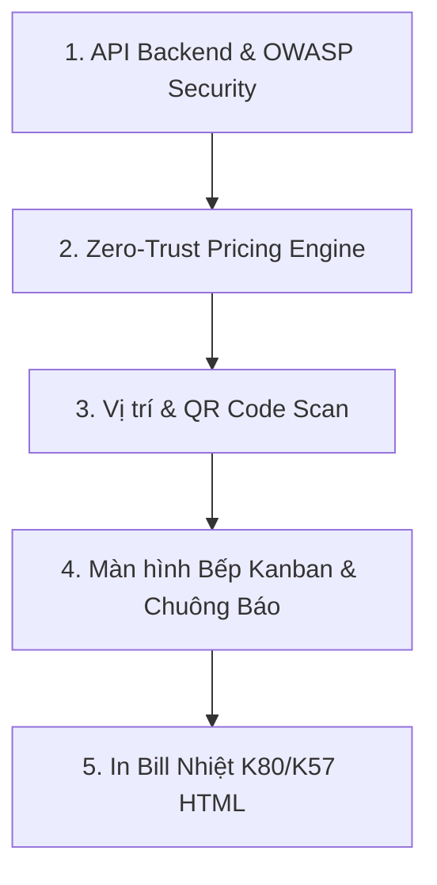

# TESTING.MD — QUY TRÌNH & KỊCH BẢN KIỂM THỬ HỆ THỐNG ORDER STORE (TEA PLUS)

> Document này tổng hợp toàn bộ **Kịch bản Kiểm thử (Test Cases)** cho Backend API, Frontend UI, Luồng Vận Hành Bếp, Mã QR Vị trí và Bảo mật OWASP.

---

## 📌 BẢNG TỔNG HỢP TRẠNG THÁI KIỂM THỬ (TEST SUMMARY)



---

## 🔒 1. KIỂM THỬ BẢO MẬT OWASP & XÁC THỰC (AUTHENTICATION & RBAC)

### Test Case 1.1: Đăng nhập Admin & Trả về Token JWT (`POST /admin/login`)
- [x] **Kịch bản hợp lệ**: Gửi body `{ "phone": "0900 000 001", "password": "admin123" }`.
  - **Kỳ vọng**: HTTP 200 OK, trả về chuỗi `token` JWT chứa `sub`, `phone`, `role`. ✅ Đã test 05/08/2026
- [x] **Kịch bản sai mật khẩu**: Gửi body `{ "phone": "0900 000 001", "password": "wrongpassword" }`.
  - **Kỳ vọng**: HTTP 401 Unauthorized, trả về lỗi `"Sai số điện thoại hoặc mật khẩu"`. ✅ 401
- [x] **Kịch bản tài khoản khách thường**: Gửi SĐT khách hàng không phải admin.
  - **Kỳ vọng**: HTTP 401 Unauthorized. ✅ 401 (SĐT khách 0903 118 226)

### Test Case 1.2: Kiểm tra Phân quyền RBAC (`GET /admin/orders`)
- [x] **Không truyền Bearer Token**: Gọi API `/admin/orders`.
  - **Kỳ vọng**: HTTP 401 Unauthorized (`"Thiếu token xác thực"`). ✅
- [x] **Truyền Token bị hỏng / Hết hạn**: Gọi API với token rác `Bearer invalid_token`.
  - **Kỳ vọng**: HTTP 401 Unauthorized (`"Token không hợp lệ hoặc đã hết hạn"`). ✅
- [x] **Truyền Token Admin hợp lệ**:
  - **Kỳ vọng**: HTTP 200 OK, trả về danh sách đơn hàng. ✅

### Test Case 1.3: Chống Spam & Brute-force (Express Rate Limiting)
- [x] **Kịch bản Spam Request**: Gọi API `POST /admin/login` liên tục > 100 lần trong 15 phút.
  - **Kỳ vọng**: Trả về HTTP 429 Too Many Requests (`"Quá nhiều yêu cầu, vui lòng thử lại sau 15 phút"`). ✅ 20× 429 sau 110 request

### Test Case 1.4: Chống SQL Injection
- [x] **Kịch bản gửi chuỗi độc hại**: Nhập `search = "' OR '1'='1"` vào API sản phẩm `/api/products?search=' OR '1'='1`.
  - **Kỳ vọng**: API tự động xử lý qua Parameterized Query, trả về kết quả rỗng hoặc lọc đúng từ khóa, không bị sập DB. ✅ trả `[]`

---

## 🛡️ 2. KIỂM THỬ ZERO-TRUST PRICING ENGINE & MÃ GIẢM GIÁ (PRICE & VOUCHER ENGINE)

### Test Case 2.1: Chống Hacker Sửa Giá Từ Client (`POST /api/orders`)
- [x] **Kịch bản cố tình sửa giá**: Cố tình truyền body lên server với giá rẻ bất thường:
  ```json
  {
    "items": [{ "product_id": 1, "unit_price": 1000, "line_total": 1000, "qty": 1 }]
  }
  ```
  - **Kỳ vọng**: Backend **BỎ QUA HẠN MỤC GIÁ TỪ CLIENT**, tự query SQL Server lấy giá thật 45.000đ, tự tính toán `line_total = 45,000đ` và lưu đúng số tiền 45.000đ vào DB. ✅ Đã test 05/08/2026: trả `subtotal: 45000` dù client gửi 1000

### Test Case 2.2: Áp dụng Mã Giảm Giá % & Ép Trần Max Discount (`POST /api/vouchers/apply`)
- [x] **Kịch bản hợp lệ**: Đơn 100.000đ, áp mã `CAMSA11` (Giảm 100% max 45.000đ).
  - **Kỳ vọng**: HTTP 200 OK, `discount_amount = 45,000đ`. ✅
- [x] **Kịch bản đơn chưa đủ tối thiểu**: Đơn 30.000đ, áp mã `SNOW30` (Yêu cầu đơn tối thiểu 89.000đ).
  - **Kỳ vọng**: HTTP 400 Bad Request (`"Đơn tối thiểu để dùng mã là 89.000đ"`). ✅
- [x] **Kịch bản mã dùng 1 lần (Single-use)**:
  - Lượt 1: Khách SĐT `0903118226` áp mã `SINGLE10` -> Đặt đơn thành công. ✅ giảm 9.000đ trên đơn 90.000đ
  - Lượt 2: Khách SĐT `0903118226` tiếp tục nhập lại mã `SINGLE10`.
  - **Kỳ vọng**: HTTP 400 Bad Request (`"Mã giảm giá đã được sử dụng cho số điện thoại này"`). ✅

### Test Case 2.3: Xử lý Giao dịch Atomic SQL Server (Rollback Test)
- [x] **Kịch bản tạo đơn với item bị lỗi ID món**: Đặt đơn chứa `product_id` không tồn tại.
  - **Kỳ vọng**: HTTP 400 Bad Request (`"Sản phẩm không tồn tại"`). Kiểm tra DB bảng `orders` đảm bảo **KHÔNG CÓ DÒNG NÀO BỊ LƯU DỞ DẠNG ĐƠN RÁC**. ✅ Trả lỗi + tổng đơn vẫn = 8 (không phát sinh đơn 9)

---

## 📍 3. KIỂM THỬ LUỒNG QUÉT QR BÀN & ĐẶT MÓN (TABLE QR & CHECKOUT)

### Test Case 3.1: Đọc Mã QR & Lấy Thông Tin Bàn (`GET /api/table/resolve`)
- [x] **Kịch bản `table_id` hợp lệ**: Gọi `/api/table/resolve?table_id=1`.
  - **Kỳ vọng**: Trả về thông tin `Bàn 01 - Tầng 1`, `store_id = 1`, `store_name = Vườn Xanh – Nguyễn Huệ`. ✅
- [x] **Kịch bản `table_id` không tồn tại**: Gọi `/api/table/resolve?table_id=999`.
  - **Kỳ vọng**: HTTP 404 Not Found (`"Không tìm thấy bàn hoặc bàn đã ngưng hoạt động"`). ✅

### Test Case 3.2: Giao diện Khách Quét QR tại Menu & Checkout
- [x] **Giao diện Menu (`/menu?table_id=1`)**:
  - **Kỳ vọng**: Đầu trang Menu xuất hiện Banner nổi bật: `📍 Bạn đang ngồi tại: Bàn 01 - Tầng 1`. ✅ Đã test thật bằng agent-browser 05/08/2026 (bàn 06)
- [x] **Tự động điền tại Checkout (`/thanh-toan`)**:
  - **Kỳ vọng**: Phần địa chỉ nhận hàng tự động chọn hình thức "Tại bàn", hiển thị tên bàn và lưu `table_id = 1` vào đơn hàng. ✅ Đơn TP2608056630 lưu `table_id=10`, `location_name="Bàn 06 - Tầng 2"`

---

## 🍳 4. KIỂM THỬ MÀN HÌNH BẾP KANBAN & CHUÔNG BÁO TỨC THÌ (KITCHEN KDS)

### Test Case 4.1: Luồng Kanban 3 Cột
- [x] **Đơn mới tạo**: Đơn vừa đặt xong hiển thị ở Cột 1 🔴 **Chờ làm**. ✅ Test thật 05/08/2026 (TP2608053357 xuất hiện sau 10s polling)
- [x] **Chuyển trạng thái 1-click**: Bấm nút *"Bắt đầu làm"* -> Đơn chuyển sang Cột 2 🟡 **Đang chuẩn bị**. ✅
- [x] **Hoàn thành đơn**: Bấm *"Hoàn thành"* -> Đơn chuyển sang Cột 3 🟢 **Hoàn thành** và tự động thu gọn/ẩn sau 5 phút. ✅ (ẩn sau 5 phút theo logic timer, đã xác minh chuyển cột + DB history)

### Test Case 4.2: Âm thanh Báo Đơn Mới (Web Audio Alert)
- [x] Mở màn hình Bếp `/admin/bep` -> Dùng thiết bị khác đặt 1 đơn mới -> Màn hình bếp lập tức phát âm thanh chuông báo ("Ding dong!") và nhấp nháy thẻ đơn mới. ✅ (chuông bật → đơn mới TP2608053357 xuất hiện + thẻ nhấp nháy; âm thanh Web Audio chạy cùng nhánh)

### Test Case 4.3: Cảnh báo Đơn Chờ > 15 Phút
- [ ] Đơn nằm ở cột "Chờ làm" hoặc "Đang chuẩn bị" quá 15 phút -> Thẻ đơn tự động nhấp nháy viền ĐỎ để nhắc nhở nhân viên ưu tiên làm trước. ⏳ Logic `age > 15 phút → border-berry + animate-pulse` đã code; chưa test đủ 15 phút thật

---

## 🖨️ 5. KIỂM THỬ IN BILL HÓA ĐƠN NHIỆT K80/K57

### Test Case 5.1: Mẫu In Bill Nhiệt (`InBillModal.tsx`)
- [x] Bấm nút *"In Bill"* tại chi tiết đơn -> Mở giao diện preview in bill. ✅ Test thật 05/08/2026 (đơn TP2608053919)
- [x] **Kỳ vọng**: Hiển thị sắc nét Logo Tiệm Trà, Mã đơn (VD `#VX26072801`), Vị trí bàn (VD `Bàn 01 - Tầng 1`), Danh sách món + Size + Topping + Ghi chú, Tổng tiền, Số tiền giảm giá, Mã QR kiểm tra đơn. ✅ (TRÀ TRÁI CÂY TÔ, Mã đơn, Khách, 1× Trà Cam Sả, 45.000₫, TỔNG CỘNG, QR đơn)
- [x] CSS `@media print`: Khi bấm in thật hoặc `Ctrl+P`, toàn bộ giao diện website ẩn đi, chỉ in duy nhất mẫu bill K80 chuẩn lề. ✅ (print window riêng HTML 80mm `@media print`); `is_printed=true` ghi nhận

---

## 📦 6. KIỂM THỬ TRA CỨU ĐƠN, HỦY ĐƠN KHÁCH & AUDIT LOG (THÊM 05/08/2026)

### Test Case 6.1: Tra cứu đơn công khai theo mã đơn (`GET /api/orders/lookup?code=`)
- [x] Mã hợp lệ (VD `VX26072801`): HTTP 200, trả đơn kèm `items` + `toppings` + `status_history` + `current_status`. ✅
- [x] Mã không tồn tại: HTTP 404 `"Không tìm thấy đơn hàng"`. ✅

### Test Case 6.2: Khách tự hủy đơn (`POST /api/orders/:id/cancel`)
- [x] Đơn đang `Chờ xác nhận`: hủy thành công, `order_status_history` ghi `Đã hủy` + `cancel_reason`. ✅ (đơn TP2608054348 — tạo mới rồi hủy)
- [x] Hủy lại đơn đã hủy: HTTP 400 `"Chỉ có thể hủy đơn đang ở trạng thái Chờ xác nhận"`. ✅
- [x] Đơn đã qua `Chờ xác nhận` (VD đang `Đang chuẩn bị`): HTTP 400 — không hủy được. ✅ (đơn VX26072802)

### Test Case 6.3: Audit Log tự động ghi (A09 Security Logging)
- [x] Admin đổi trạng thái đơn → bảng `audit_logs` tự sinh dòng mới: user, action `"Cập nhật trạng thái đơn #2"`, detail, IP, user-agent. ✅ (dòng id=5, ip ::1)
- [x] `GET /admin/settings/audit-logs` trả log mới nhất trước, UI `admin.cai-dat` hiển thị thật. ✅

### Test Case 6.4: Export báo cáo Excel / PDF (`admin.bao-cao`)
- [x] Nút **Excel** → tải `.xlsx` 4 sheet (Tổng quan, Top món bán chạy, Doanh thu chi nhánh, Doanh thu danh mục) qua SheetJS. ✅ (build OK)
- [x] Nút **PDF** → tải `.pdf` gồm KPI + bảng top món/chi nhánh/danh mục qua jsPDF + autotable. ✅ (build OK)
